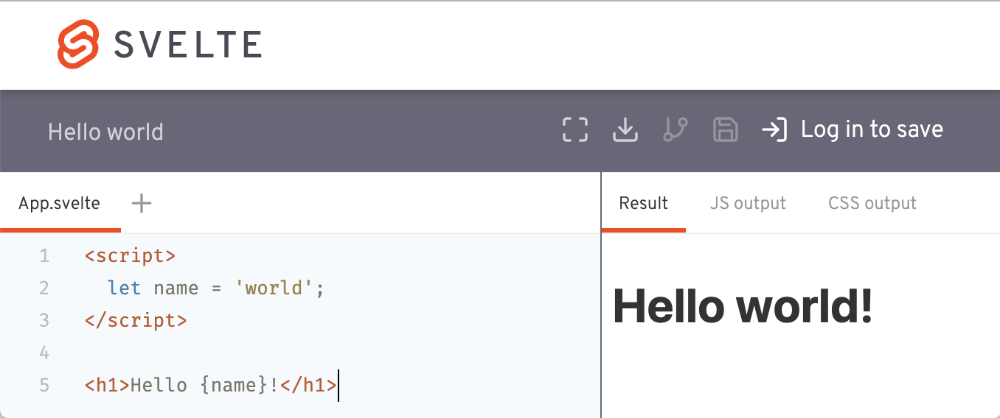
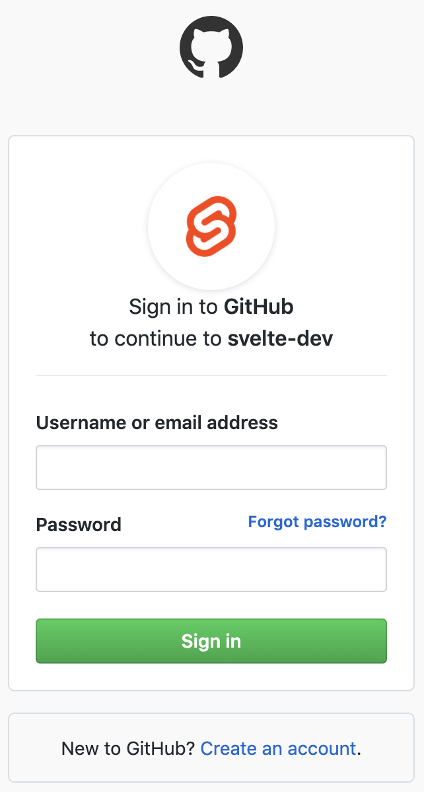
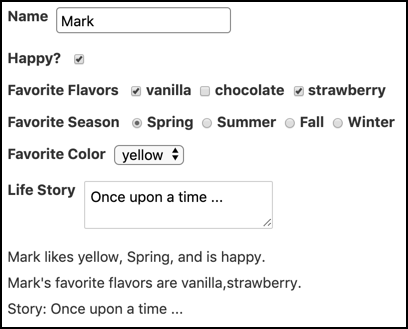
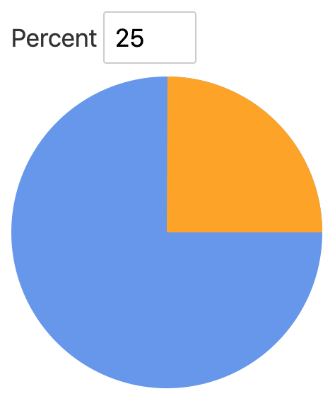
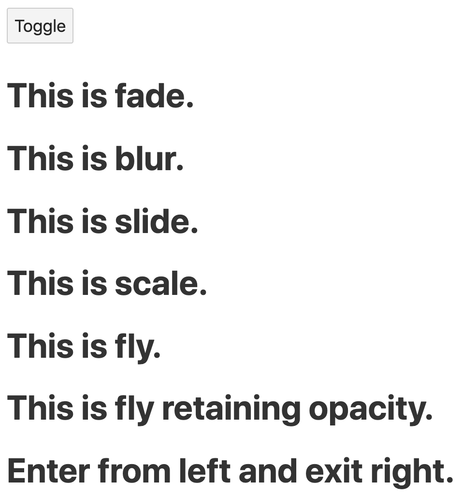
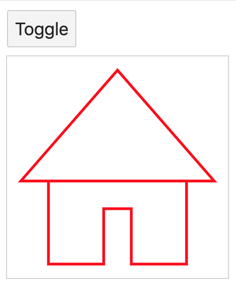
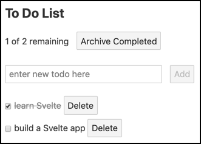
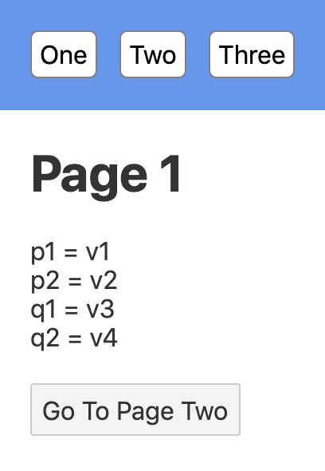
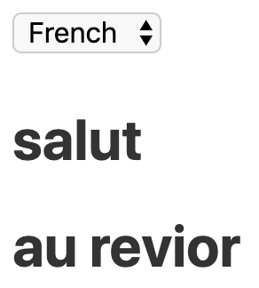

# Svelte - Web Development Make Easier

TODO: Cover everything at <https://svelte.dev/examples>.
TODO: Cover everything in the "Svelte Handbook".
TODO: Should you cover svelte-gl?
TODO: See svelte/book/example-app-idea.md.

This article provides a thorough introduction to Svelte
and walks you through the fundamentals necessary
to start building web applications with it.

## What Is Svelte

Svelte is an alternative to web frameworks like React, Vue, and Angular.
Like its counterparts, Svelte can be used to build entire web applications.
It can also be used to create custom elements that are usable
in existing web apps implemented with other frameworks.

Svelte was developed by Rich Harris, who formerly worked at
_The Guardian_ and is currently at _The New York Times_.
Work on Svelte began in 2016.
Harris previously created the Ractive web framework (<https://ractive.js.org/>),
which is used at _The Guardian_ and inspired parts of Vue.
He also created the Rollup module bundler,
which is an alternative to Webpack and Parcel.

Svelte has not yet received the attention it deserves.
When it is mentioned, the focus is typically on its ability to
produce bundled code that is significantly smaller than the alternatives.
However, Svelte makes many tasks easier, including defining components,
managing component state, managing application state, and adding animation.

## Why Consider Svelte

Svelte apps have smaller bundle sizes than
equivalent apps created with other web frameworks.
This is achieved by compiling the application code
to a single, optimized JavaScript file
that includes a very small amount of framework code.

Svelte is a web application compiler implemented in TypeScript.
It is not a runtime library.

The fact that Svelte compiles `.svelte` files to JavaScript
has many benefits. One is that the new features can be added to
Svelte without bloating the bundle size of Svelte applications.
This is because the compiler only includes code
for the features of Svelte that are actually used.

For example, the Todo app presented later has a bundle size
that is 13% of the size of an equivalent React app.
These apps can be found at <https://github.com/mvolkmann/svelte-todo>
and <https://github.com/mvolkmann/react-todo>.

The website at
<https://www.freecodecamp.org/news/a-realworld-comparison-of-front-end-frameworks-with-benchmarks-2019-update-4be0d3c78075/>
catalogs statistics on building a real world web application using many web frameworks.
The reported gzipped app size in KBs for some popular choices include:

- Angular + ngrx: 134
- React + Redux: 193
- Vue: 41.8
- Svelte: 9.7

Svelte also requires less code to implement the same functionality.
The reported number of lines of code for these same options are:

- Angular + ngrx: 4210
- React + Redux: 2050
- Vue: 2076
- Svelte: 1116

This is significant for multiple reasons.
Having less code to read means there is less code to understand.
It also means there are fewer places for bugs to hide.

Some web frameworks, including React and Vue,
use a virtual DOM to optimize rendering changes.
When components re-render, the framework builds a new version of the DOM
in memory and then compares it to the previous version.
Only the differences are applied to the actual DOM.
While this is faster than updating everything in the actual DOM,
it does take time to build a virtual DOM
and compare it to the previous one.

Svelte provides reactivity without using a virtual DOM.
It does this by tracking changes to top-level component variables
that affect what each component renders and
only re-rendering those parts of the DOM when changes are detected.
It doesn't re-render the entire component.
This contributes to good performance.

Svelte dramatically simplifies component and application state management.
Contributing features include context, stores, and module context,
each of which is covered in detail later.

Svelte provides runtime warnings for accessibility issues.
For example, `` elements that have no `alt` attribute are flagged.

Svelte does not currently support using TypeScript
but work to add this is underway.
See <https://github.com/sveltejs/svelte/issues/1639>.
A workaround using `svelte-preprocess` is described later.

Svelte Native supports developing mobile apps.
It builds on NativeScript.

## IE11 Support

Polyfills are required to run Svelte apps in Internet Explorer 11.
See <https://github.com/sveltejs/svelte/issues/2621>.

It may be difficult or impossible to get Svelte apps
to run in versions of Internet Explorer before version 11.

## Does Svelte Disappear

Some say that Svelte disappears once an app is built.

The Svelte library is mostly defined by `.js` files
in the `node_modules/svelte` directory.
The main functions are defined in `internal.js`
which is currently around 1,400 lines of code.
Other library files are used for specific features.
These include `easing.js`, `motion.js`, `register.js`,
`store.js`, and `transition.js`.

Entering `npm run build` produces files in the `public` directory
including `bundle.js`.
Svelte library functions that are used by the app
are copied to the top of `bundle.js`.
In the case of the Todo app shown later,
this is approximately 500 lines of code.

So Svelte library code doesn’t disappear,
it is just very small compared to other web frameworks.

## Important Resources

Here is a list of important resources to check out
when learning Svelte:

- "Rethinking reactivity" - <https://www.youtube.com/watch?v=gJ2P6hGwcgo>
  This is a talk by Rich Harris given multiple times.
  The most recent was at the "Shift Dev 2019" conference.
  It describes the motivations behind Svelte 3
  and provides a brief introduction.
- Svelte home page - <https://svelte.dev>
- Svelte Tutorial - <https://svelte.dev/tutorial>
- Svelte API - <https://svelte.dev/docs>
- Svelte Examples - <https://svelte.dev/examples>
- Online Svelte REPL - <https://svelte.dev/repl>  
  This is great for trying small amounts of Svelte code.
  It can also display generated code and
  save code for sharing and submitting issues.
- Svelte Blog - <https://svelte.dev/blog>
- Discord chat room
  <https://discordapp.com/invite/yy75DKs>
- Svelte GitHub repository - <https://github.com/sveltejs/svelte>
- Community Resources - <https://svelte-community.netlify.com/resources/>

## Svelte REPL

The easiest way to experiment with Svelte is the use the REPL.
Browse <https://svelte.dev/repl/>.
Code for a "hello world" app is provided by default.
Modify this code to try various features of Svelte.



To save apps created in the REPL so they can be recalled
in the future, click "Log in to save" in the upper-right.
This will open the browser window shown below.



Enter your GitHub username and password
and press the "Sign in" button.

The `App.svelte` can import other files defined in additional tabs.
To add more `.svelte` files, click the "+" to the right
of the existing file tabs and give it a name.
To delete a `.svelte` file, hover over its tab
and click the "x" that appears.

The right side of the page contains three tabs.

The "Result" tab shows the rendered output of `App.svelte`.

The "JS output" tab shows the JavaScript
generated by the Svelte compiler for the app.

The "CSS output" tab shows the CSS
generated by the Svelte compiler for the app.
Unused CSS selectors are not included.
All selectors include generated CSS class names
that scope the CSS to the component.

The top bar in the REPL contains links to many Svelte resources
including a tutorial, the API docs, examples, the Svelte blog,
the Svelte FAQ, the main page for Sapper, the Discord chat,
and the Svelte GitHub repo.

To hide this bar in order to gain more editing room, press
the "fullscreen editor" icon which looks like a dashed square.
This icon changes to an "X".
To restore the top bar, click the "X".

To make a copy of the current app so it can be modified
without changing the current app,
press the "fork" icon.

To save the current app,
enter a name for it on the left size of the gray bar at the top
and press the floppy disk icon.
Pressing ctrl-s (or cmd-s on macOS) also saves.

There is currently no option in the REPL to format `.svelte` files.

To download the current app so you can continue developing it locally,
press the download icon.
This downloads a zip file whose name defaults to "svelte-app.zip".
To prepare for running this app locally, unzip this file,
cd to the directory it creates, and enter "npm install".
To run the app in development mode, enter "npm run dev".

To share a REPL app, copy the URL in the browser address bar
and provide it to other developers.
This is great for asking questions in the Svelte Discord chat.
Post a question along with a REPL URL.

To return to a previously saved app,
hover over your user name in the upper-right
and click "Your saved apps".
This will display a list of saved app names.
Click one to load it.

TODO: How do you ask the REPL to create a new app, starting from Hello World?

## Creating a Svelte App

Let's walk through the steps to create and run a Svelte application.

1. Install Node.js from <https://nodejs.org>.

   This installs the `node`, `npm`, and `npx` commands.

2. `npx degit sveltejs/template` _`app-name`_

   Rich Harris created the `degit` tool to simplify project scaffolding.
   It downloads a git repo, by default the master branch.
   In this case "sveltejs" is the user name and "template" is the repo.
   The second argument is the name of application
   and the name of the sub-directory to create.

3. `cd` _`app-name`_

4. `npm install`

5. `npm run dev`

   This starts a local HTTP server and provides live reload,
   unlike `npm run start` which omits live reload.
   Syntax errors are reported in the window where this is running,
   not in the browser.
   This happens because Svelte doesn’t produce
   a new version of the app if there are errors.

6. Browse localhost:5000

   This just outputs "Hello world!" in purple.

Now you are ready to start modifying the app.

After saving changes, if the browser doesn't render the expected output,
check the terminal window where the server is running for compilation errors.

See <https://github.com/sveltejs/svelte/issues/3661>.
A peek at the `package.json` file reveals two things.
The first is that Svelte uses Rollup by default for module bundling.
If desired it can be changed to use Webpack or Parcel.
The second is that Svelte apps have no required runtime dependencies,
only devDependencies.

The most important starting files are
`public/index.html`, `src/main.js`, and `src/App.svelte`.
These files use tabs for indentation, but
the tabs can be replaced by spaces if preferred.

The file `public/index.html` contains the following:

```html
<!DOCTYPE html>
<html>
  <head>
    <meta charset="utf8" />
    <meta name="viewport" content="width=device-width" />
    <title>Svelte app</title>
    <link rel="icon" type="image/png" href="favicon.png" />
    <link rel="stylesheet" href="global.css" />
    <link rel="stylesheet" href="bundle.css" />
  </head>
  <body>
    <script src="bundle.js"></script>
  </body>
</html>
```

Note how this pulls in two CSS files and one JavaScript file.
`global.css` holds CSS that can affect any component.
`bundle.css` is generated from the CSS in each component.
`bundle.js` is generated from the JavaScript and HTML in each component
and any other JavaScript in the app.

The file `src/main.js` contains the following:

```js
import App from './App.svelte';

const app = new App({
  target: document.body,
  props: {
    name: 'world'
  }
});

export default app;
```

This renders the `App` component.
The `target` property specifies where the component should be rendered.
For most apps this is the body of the document.

This passes the `name` prop to the `App` component.

Typically the topmost component does not need props
and the `props` property here can be deleted.

The file `src/App.svelte` contains the following:

```html
<script>
  export let name;
</script>

<style>
  h1 {
    color: purple;
  }
</style>

<h1>Hello {name}!</h1>
```

Exported variables can be set as props in files that use the component.

Curly braces are used to output the value of a JavaScript expression.
This is referred to as "interpolation".
As we will see later, curly braces are also
used for dynamic attribute values.

## Defining Components

Popular web frameworks use different kinds of
JavaScript containers to define components.
Angular uses classes.
React uses functions or classes.
Vue uses object literals.

Svelte doesn't use any kind of container.
A Svelte component is defined by a `.svelte` file
that contains JavaScript code, CSS, and HTML.
These are combined to form the component definition
which automatically becomes the default export.

The `.svelte` files can be anywhere under the `src` directory.
They contain the following three sections, all of which are optional.

```html
<script>
  // Scoped JavaScript goes here.
</script>

<style>
  /* Scoped CSS rules go here. */
</style>

<!-- HTML to render goes here. -->
```

Note the different comment syntax
that can be used in each section.

## VirtualList

The `VirtualList` component is a Svelte component in npm
that only renders items that will be visible in the browser.
See <https://www.npmjs.com/package/@sveltejs/svelte-virtual-list>.
It can improve the performance of apps that render a large number
of similar DOM elements.

## Component Names

Svelte component definitions do not specify a component name.
The component name is not provided inside a source file by a
class name, function name, or property value
like in other frameworks.
The component name is associated when a `.svelte` file
is imported and it must start with an uppercase letter.

Lowercase names are reserved for predefined elements
like those provided by HTML and SVG.

For example:

```js
// Somewhat confusing
import AnyNameIWant from './some-name.svelte';

// Less confusing
import SameName from './SameName.svelte';
```

## Sharing Data

There are four ways to share data between Svelte components.

1. **Props**  
   These pass data from parent components to child components.

2. **Contexts**  
   These allow ancestor components to
   make data available to descendant components.

3. **Stores**  
   These store data outside any component and
   make it available to all of them.

4. **Module Scope**  
   These store data in component modules and
   make it available to all instances of the component.

These builtin approaches are so useful that there is
really no need for state management libraries.

## Props

Components can accept input through props.
They are specified as attributes on
component elements rendered by parent components.

For example, a parent component can do this:

```html
<script>
  import Hello from './Hello.svelte';
</script>

<Hello name="Mark" />
```

In this case the value of the `name` prop is a literal string.

Prop values that are JavaScript expressions or non-string literals
must be surrounded by curly braces instead of quotes.
These values can be any kind of JavaScript value,
including objects, arrays, and functions.

The child component defined in `src/Hello.svelte` can do this:

```html
<script>
  export let name = 'World';
</script>

<div>
  Hello, {name}!
</div>
```

Props are declared in the `<script>` section of a component
with the `export` keyword.
This uses valid JavaScript syntax in a Svelte-specific way.

The `let` keyword must be used instead of `const`
since the parent element can change the value.

Assigning default values to props is optional.

The npm package `prop-types` that is used to provide prop type checking
like in React can also be used with Svelte.
This is described in the "Prop Types" section later.

## Directives

Directives are special props that are written as
a directive name, followed by a colon and more.
We will see each of these later.

The "bind" directive binds a prop value to a variable.
See the sections on "Binding" later.

The "class" directive toggles the presence of a CSS class
based on the truthiness of a variable.
See the "Styling" section later.

The "on" directive registers an event listener.
See the section on "Event Handling" later.

The "use" directive specifies a function that will be
passed the created DOM element.
See the "Actions" section later.

The directives "animate", "transition", "in", and "out" support animations.
See the "Animation" section later.

Svelte does not support creating custom directives.

## Attributes

Attribute values for elements can be supplied from JavaScript expressions.
The syntax is:

`<`_`element-name attribute-name`_`="`_`expression`_`" />`

Expressions can also be embedded in string values.

For example:

```html
<Person fullName="{firstName} {middleInitial}. {lastName}" />
```

There is shorthand syntax for when an attribute value
is in a variable with same name as the attribute.
For example:

```html
<Person {fullName} />
```

The spread operator can be used to insert multiple attributes
if they are in an object where the keys are attribute names
and the values are their values.

For example:

```svelte
<script>
  let score = 0;
  const inputAttrs = {
    type: 'number',
    max: 10,
    min: 0,
    value: score
  };
</script>

<input {...inputAttrs} bind:value={score} />
```

The example above uses `bind` to simulate a
two-way data binding. This is explained more later.

## Styling

Styles in `<style>` tags of `.svelte` files
are automatically scoped to the component.

Svelte achieves the scoping by adding the same generated CSS class name,
`svelte-`_`hash`_, to each rendered element of the component
that is potentially affected by these CSS rules.

Global styles can be defined in `public/global.css`.
The can also be defined in the `<style>` tag of any component
using the `:global(selector) { ... }` syntax.
Neither of these override styles specified inside components unless
selectors include the component-specific class name "svelte-{hash}"

For example:

```html
<style>
  :global(h1) {
    color: red;
  }
</style>
```

As in standard CSS, comments within the style tag
must use `/* */` comment delimiters.

The "svelte3" ESLint plugin warns about unused CSS selectors.

A CSS class can be conditionally added to an element.

In the following example the CSS class `error`
is only added if `status` is greater than zero.

```svelte
<div class:error={status > 0}>{result}</div>
```

In the following example the CSS class `error`
is only added if the variable `error` has a truthy value.

```svelte
<div class:error>{result}</div>
```

## Importing Components

Components can import others inside their `<script>` tag.
For example:

```js
import Other from './Other.svelte';
```

Imported components can be used in the HTML section
of the component that imports them.

## Inserting HTML

To render a JavaScript expression whose value is an HTML string
use the syntax `{@html` _`expression`_`}`.

Suppose `markup` is a variable that holds a string of HTML.
The following will render it:

```html
<p>{@html markup}</p>
```

In order to avoid cross-site scripting,
escape HTML from untrusted sources.

## Reactivity

Changes to top-level variables referenced in interpolations automatically cause those interpolations to be reevaluated.

For example:

```svelte
<script>
  let count = 0;
  const increment = () => count++;
</script>

<div>count = {count}</div>
<button on:click={increment}>+</button>
```

A new value must assigned trigger this.
Pushing new elements onto an array doesn’t do this.
The following approaches do work:

```js
myArr = myArr.concat(newValue);

myArr = [...myArr, newValue];

// Alternative trick
myArr.push(newValue);
myArr = myArr;
```

## Reactive Statements

Beginning a JavaScript statement with a name followed by a colon
creates a "labelled statement".
Labeled statements can be used as targets
of `break` and `continue` statements.

Interestingly it is not an error in JavaScript to use the
same label name for more than one statement in the same scope.

When used on a top-level statement (not nested inside a function or block)
and the name is a dollar sign, Svelte treats it as a "reactive statement".

This is another example of the Svelte compiler
treating valid JavaScript syntax in a special way.
Such statements are repeated when the value of
any variable referenced by the statement changes.
This is somewhat like "computed properties" in Vue.

When a reactive statement is an assignment,
it is called a "reactive declaration".

For example:

```js
// The value of average is computed initially and
// recomputed if the value of total or count changes.
$: average = total / count;

// The value of count is output in the devtools console
// when this statement is executed and again every time it changes.
// This is great for debugging!
$: console.log('count =', count);
```

When `$:` is applied to an assignment to an undeclared variable
(as in the assignment to `average` above),
the `let` keyword is not allowed.

`$:` can also be applied to a block.

For example:

```js
$: {
  // statements to be repeated go here
}
```

`$:` can also be applied to multiline statements such as `if` statements.

For example:

```js
$: if (someCondition) {
  // body statements
}
```

The example above executes if any variables referenced in the
condition or the body change, the condition is re-evaluated.
But of course the body only executes if the condition is true.

For example, if a condition includes calls to functions,
they will be called if any references in the body have changed.

## Logic In Markup

There are three common approaches to adding
conditional and iteration logic in markup.

React uses JSX where logic is implemented
by JavaScript code in curly braces.

Angular and Vue support framework-specific attributes for logic.
For example, Angular supports `ngIf` and `ngFor`,
and Vue supports `v-if` and `v-for`.

Svelte supports Mustache-like custom syntax that wraps elements.
Examples include `{#if}` and `{#each}`.

### if Statement

Svelte conditional logic begins with `{#if` _`condition`_`}`.
Starting with `#` indicates a block opening tag.

Mark the end with `{/if}`.
Starting with `/` indicates a block ending tag.

The markup to be conditionally rendered goes between these.

Other block tags that can be included between these are
`{:else if` _`condition`_`}` and `{:else}`.
Starting with `:` indicates a block continuation tag.

For example:

```svelte
{#if color === 'yellow'}
  <div>Nice color!</div>
{:else if color === 'orange'}
  <div>That's okay too.</div>
{:else}
  <div>Questionable choice.</div>
{/if}
```

While this syntax may seem odd at first,
it does have the benefit of being able to conditionally render
multiple elements.
The Angular/Vue approach of adding special attributes to elements
requires specifying a common parent element.

### each Statement

Svelte iteration begins with `{#each` _`iterable`_ as _`element`_`}`.

Mark the end with `{/each}`.

The markup to be rendered for each element goes between these.

Often the iterable is an array, but any iterable value can be used.
The expression that follows `#each` can be any JavaScript expression
that results in an iterable including a literal array,
a variable, or a function call that returns an iterable.

Content after `{:else}` is rendered when the iterable is empty.

For example, suppose the variable `colors` is set to
`['red', 'green', 'blue']`:

```svelte
<!-- Outputs each color on a separate line using the color. -->
{#each colors as color}
  <div style="color: {color}">{color}</div>
{/each}

<!-- Outputs each color on a separate line preceded by
     its 1-based position followed by a paren. -->
{#each colors as color, index}
  <div>{index + 1}) {color}</div>
{/each}

<!-- This uses destructuring to get specific
     properties of the objects in `people`. -->
{#each people as {name, age}}
  <div>{name} is {age} years old.</div>
{:else}
  <div>There are no people.</div>
{/each}
```

If items in a list will be added, removed, or modified
then a unique identifier should be supplied for each element.
This is similar to the need for the `key` prop in React and Vue.

In Svelte the unique identifier is supplied as part of the `#each` syntax,
not as an element prop. In the following example, the unique identifier
for each `person` is their `id` property.

```svelte
{#each people as person (person.id)}
  <div>{person.name} is {person.age} years old.</div>
{/each}
```

### Promises

Svelte provides markup syntax to wait for promises to resolve or reject.
It can render different output based on whether the promise is
still pending, has resolved, or has rejected.

The following examples assume the component has
a `getData` function that returns a `Promise`.
Any variable name can be used after `:then` and `:catch`
to receive the resolved or rejected value.

```svelte
{#await getData()}
  <div>Waiting for data ...</div>
{:then result}
  <div>result = {result}</div>
{:catch error}
  <div class="error">Error: {error.message}</div>
{/await}
```

The next example omits the markup to render
while waiting for the `Promise` to resolve.
The `:catch` portion can also be omitted.

```svelte
{#await getData() then result}
  <div>result = {result}</div>
{:catch error}
  <div class="error">Error: {error.message}</div>
{/await}
```

## Slots

Slots allow child content to be passed to a component.
The receiving component can decide whether and where to render it.

Note that whitespace counts as child content.

The receiving component can mark the spot where
all child content is rendered with `<slot />`.
This is called the "default slot".

It can also provide default content to render for parent elements
that do not provide content for the slot.
For example, `<slot>Thanks for nothing!</slot>`.

Named slots allow parent elements to provide multiple sets of content
for which the receiving component can decide whether and where to render.
The parent element identifies these with a `slot` attribute.
The child element defines where they will be rendered
with `slot` elements that have a matching `name` attribute.

Here is an example of HTML from a parent element that targets
multiple named slots in the child element `ShippingLabel`:

```html
<ShippingLabel>
  <div slot="address">
    123 Some Street,<br />
    Somewhere, Some State 12345
  </div>
  <div slot="name">Mark Volkmann</div>
</ShippingLabel>
```

Here is `ShippingLabel.svelte`:

```html
<style>
  label {
    display: block;
    font-weight: bold;
  }
</style>

<div>
  <label>Ship To:</label>
  <slot name="name">unknown</slot>
  <slot name="address" />
</div>
```

## Binding Form Elements

Form elements like `<input>`, `<textarea>`, and `<select>`
can be bound to a variable.
This simulates two-way data binding.

In addition to providing the current value,
it provides event handling for updating the variable
when the user changes the form element value.

For `<input>` elements with the type `number` or `range`
this automatically coerces values from strings to numbers.

For example, consider the following HTML form:



Here is an implementation that uses a single Svelte component.
Note the use of `bind:` in several places.

```svelte
<script>
  const colors = ['red', 'orange', 'yellow', 'green', 'blue', 'purple'];
  const flavors = ['vanilla', 'chocolate', 'strawberry'];
  const seasons = ['Spring', 'Summer', 'Fall', 'Winter'];
  let favoriteColor = '';
  let favoriteFlavors = [];
  let favoriteSeason = '';
  let happy = true;
  let name = '';
  let story = '';
</script>

<style>
  div {
    margin-bottom: 10px;
  }

  input,
  select {
    border: solid gray 1px;
    border-radius: 4px;
    padding: 4px;
  }

  input[type='checkbox'],
  input[type='radio'] {
    margin-left: 5px;
  }

  label {
    display: inline-block;
    font-weight: bold;
    margin-right: 5px;
    vertical-align: top;
  }
</style>

<div class="form">
  <div>
    <label>Name</label>
    <input type="text" bind:value={name} />
  </div>
  <div>
    <label>Happy?</label>
    <!-- For checkboxes, bind to the "checked" property rather than "value". -->
    <input type="checkbox" bind:checked={happy} />
  </div>
  <div>
    <label>Favorite Flavors</label>
    {#each flavors as flavor}
    <label>
      <!-- Using "bind:group" with a set of related checkboxes
           makes the value an array of strings. -->
      <input type="checkbox" value={flavor} bind:group={favoriteFlavors} />
      {flavor}
    </label>
    {/each}
  </div>
  <div>
    <label>Favorite Season</label>
    {#each seasons as season}
    <label>
      <!-- Using "bind:group" with a set of related radio buttons
           makes the value a single string. -->
      <input type="radio" value={season} bind:group={favoriteSeason} />
      {season}
    </label>
    {/each}
  </div>
  <div>
    <label>Favorite Color</label>
    <!-- To change a select to a scrollable list
         that allows selecting multiple options,
         add the "multiple" attribute. -->
    <select bind:value={favoriteColor}>
      <option />
      {#each colors as color}
      <!-- <option> elements can have a "value" attribute
            and its value can be a string, number, or object. -->
      <option>{color}</option>
      {/each}
    </select>
  </div>
  <div>
    <label>Life Story</label>
    <textarea bind:value={story} />
  </div>

  <!-- This part just reports the variable values set by binds,
       but only if name has a value. -->
  {#if name}
  <div>
    {name} likes {favoriteColor}, {favoriteSeason},
    and is {happy ? 'happy' : 'unhappy'}.
  </div>
  <div>{name}'s favorite flavors are {favoriteFlavors}.</div>
  <div>Story: {story}</div>
  {/if}
</div>
```

In addition to binding to primitive variables,
form elements can bind to object properties.
User input then causes those objects to be mutated.

## Binding Custom Props

Svelte can bind a child component prop to a variable in the parent component.
This allows child components to change values of a parent component variables.
For example, here is a parent component:

```svelte
<script>
  import Child from './Child.svelte';
  let pValue = 1;
</script>

<div>pValue = {pValue}</div>
<Child bind:cValue={pValue} />
```

And here is the child component:

```svelte
<script>
  export let cValue = '';
  const double = () => (cValue *= 2);
</script>

<div>cValue = {cValue}</div>
<button on:click={double}>Double</button>
```

When the button in the `Child` component is pressed,
`cValue` is doubled and that becomes the new value
of `pValue` because it is bound to `cValue`.

Child components can also use reactive declarations
to modify the value of a prop.
If the parent component uses `bind` with that prop
it will also be updated.

## Event Handling

Event handling is specified with the `on:`_`event-name`_ attribute
whose value is a function to invoke when the event is dispatched.
The event name can be the name of a standard DOM event or a custom event.
An event object is passed to the given function.

For example:

```html
<!-- The function "handleClick" must be defined in the <script> section above. -->
<button on:click={handleClick}>Press Me</button>

<!-- This demonstrates inline event handling using an anonymous function.
     It just sets the variable "clicked" to the DOM element for the button. -->
<button on:click={event => clicked = event.target}>Press Me</button>
```

Multiple event handling functions can be specified for the same event
and each will invoked when the event is dispatched.

For example:

```svelte
<button on:click={doOneThing} on:click={doAnother}>Press Me</button>
```

Event handlers can specify any number of event modifiers
with vertical bars preceding modifier names.
For example:

```svelte
<button on:click|once|preventDefault={handleClick}>Press Me</button>
```

The supported modifiers are:

- `capture`

  This causes the handler function to only be invoked
  in the capture phase, not the default bubbling phase.

- `once`

  This removes the handler after the first occurrence of the event.

- `passive`

  This can improve scrolling performance. You can learn more at
  <https://developer.mozilla.org/en-US/docs/Web/API/EventTarget/addEventListener#Improving_scrolling_performance_with_passive_listeners>.

- `preventDefault`

  This prevents the default action for the event from occurring.
  For example, it can stop a form submission.

- `stopPropagation`

  This prevents subsequent handlers in the
  capture/bubbling flow from being invoked.

Omitting the event handling function from an `on:` attribute
is a shorthand to forward events up to the parent component.

For example, supposed part of the component hierarchy is
`A` > `B` > `C` and `C` emits the event "foo".
`B` can forward it up to `A` with `<C on:foo />`.

Note that the `on:` attribute has no value.

This approach can also be used to forward DOM events.

Components can dispatch events.

For example:

```html
<script>
  import {createEventDispatcher} from 'svelte';

  // This must be called when the component is instantiated,
  // not conditionally or later.
  const dispatch = createEventDispatcher();

  function sendEvent() {
    // The data associated with the event can be a primitive or an object.
    // Event names should not contain dashes.
    dispatch('someEventName', optionalData);
  }
</script>
```

These events only go to the parent component.
They do not automatically bubble farther up the component hierarchy.

Parent components use `on:` to listen for events from child components.

For example if the parent component defines the function `handleEvent`,
it can register that function to be invoked when
a `Child` component dispatches an event with a given name.

```svelte
<Child on:someEventName={handleEvent} />
```

## Lifecycle Functions

Svelte supports registering functions to be invoked when
four specific events occur in the lifecycle of a component instance.
These include:

1. When it is mounted
2. Before it is updated
3. After it is updated
4. When it is destroyed

The term "mounted" means that the component instance
has been added to the DOM.

The term "destroyed" means that the component instance
has been removed from the DOM.

A component is "updated" if any of its props change
or if any of its state variables change.
State variables are top-level variables in a component
that are used in its HTML.

To register functions for these events,
import the provided lifecycle functions from the `svelte` package.

```js
import {afterUpdate, beforeUpdate, onDestroy, onMount} from 'svelte';
```

Then call these functions, passing them a function to be called
when the event occurs.

The most commonly used lifecycle function is `onMount`.
One use is to move focus to a given form element.
Another is to retrieve data needed by the component from a REST service.

Here's an example that moves focus.

```svelte
<script>
  import {onMount} from 'svelte';
  let name = '';
  let nameInput;
  onMount(() => nameInput.focus());
</script>

<input bind:this={nameInput} bind:value={name} />
```

The attribute `bind:this` sets the variable specified as its value
to a reference to the DOM element for the `input`.
This is used in the function passed to `onMount`
to move focus to the `input`.

TODO: Should you mention here using an "action" to do this instead?

To register a function to be called when a component
is removed from the DOM, pass the function to `onDestroy`.

An alternative to using `onDestroy` is to return a function
from the one registered with `onMount`.
This function will be called
when the component is removed from the DOM.
This approach is a bit like the `useEffect` hook in React,
but differs in that functions passed to `useEffect`
are run on both mount and updates.

For example, suppose we want to cycle through a set of colors
for a header.

```js
const colors = ['red', 'orange', 'yellow', 'green', 'blue', 'purple'];
let colorIndex = 0;

onMount(() => {
  const token = setInterval(() => {
    colorIndex = (colorIndex + 1) % colors.length;
  }, 500);
  return () => clearInterval(token);
});
```

With this in place we can use `colorIndex` as follows;

```html
<h1 style="color: {colors[colorIndex]}">Some Title</h1>
```

Lifecycle functions can be called from helper functions.
These can be defined in separate `.js` files which
allows them to be imported and used by multiple components.
This is similar to defining custom React hooks.

It is recommended to name these helper functions starting with "on",
similar to how React hook names start with "use".

Lifecycle functions are not called when components are server-side rendered.
TODO: Verify that this is true for all of them.

## Reusable Components

Nearly every web app benefits from having a collection of
general purpose components that are used throughout the app.
They add UI consistency.
They also reduce errors by reducing duplicated code.

Let's implement some reusable components to support the form example
in the "Binding Form Elements" example above.
We will create the components `LabeledChildren`,
`LabeledInput`, `LabeledCheckbox`, `LabeledCheckboxes`,
`LabeledRadioButtons`, `LabeledSelect`, and `LabeledTextArea`.

TODO: See how big-svelte-demo adds language translation.

TODO: Add example of using Spinner component.  See big-svelte-demo.

TODO: Add example of using Dialog component.  See big-svelte-demo.

The following component demonstrates using each
of the labeled components.

```html
<script>
  import { onMount } from 'svelte';

  import LabeledCheckbox from './LabeledCheckbox.svelte';
  import LabeledCheckboxes from './LabeledCheckboxes.svelte';
  import LabeledInput from './LabeledInput.svelte';
  import LabeledRadioButtons from './LabeledRadioButtons.svelte';
  import LabeledSelect from './LabeledSelect.svelte';
  import LabeledTextArea from './LabeledTextArea.svelte';
  import LanguageSelect from './LanguageSelect.svelte';

  let colorList = [];
  let flavorList = [];
  let seasonList = [];

  colorList = [
    { label: 'red' },
    { label: 'orange' },
    { label: 'yellow' },
    { label: 'green' },
    { label: 'blue' },
    { label: 'purple' }
  ];

  flavorList = [
    { label: 'Vanilla' },
    { label: 'Chocolate' },
    { label: 'Strawberry' }
  ];

  seasonList = [
    { label: 'Spring' },
    { label: 'Summer' },
    { label: 'Fall' },
    { label: 'Winter' }
  ];

  let favoriteColor = '';
  let favoriteFlavors = [];
  let favoriteSeason = '';
  let happy = true;
  let name = '';
  let story = '';
</script>

<style>
  .container {
    display: flex;
    flex-direction: column;
  }
</style>

<form class="container" on:submit|preventDefault>
  <LabeledInput label="Name" bind:value={name} />

  <LabeledCheckbox label="Happy?" bind:checked={happy} />

  <LabeledCheckboxes
    label="Favorite Flavors"
    list={flavorList}
    bind:selected={favoriteFlavors} />

  <LabeledRadioButtons
    className="lrb"
    label="Favorite Season"
    list={seasonList}
    bind:value={favoriteSeason} />

  <LabeledSelect
    label="Favorite Color"
    list={colorList}
    bind:value={favoriteColor} />

  <LabeledTextArea label="Life Story" bind:value={story} />

  {#if name}
    <div>
      {name} likes {favoriteColor}, {favoriteSeason}, and is {happy ? 'happy' : 'unhappy'}.
    </div>
    <div>{name}'s favorite flavors are {favoriteFlavors.join(' and ')}.</div>
    <div>Story: {story}</div>
  {/if}
</form>
```

### LabeledChildren

This component is used by all the other components
whose name begins with "Labeled".
It simply renders a label followed by one or more
other components that are placed in a default slot.

The `label` prop is a required string.
The `className` prop is an optional string that is
useful for applying styling from outside this component.

This component uses flexbox for layout.

```html
<script>
  export let className = '';
  export let label;
</script>

<style>
  .container {
    display: inline-flex;
    flex-direction: column;
    align-items: flex-start;

    font-size: 14px;
    margin-bottom: 0.5rem;
    margin-top: 0.5rem;
  }

  label {
    font-weight: bold;
    margin-bottom: 0.5rem;
  }
</style>

<div class={'container ' + className}>
  <label class="title">{label}</label>
  <slot />
</div>
```

### LabeledInput

This component renders a label and an input.

```html
<script>
  /* Example usage:
  <LabeledInput label="Name" bind:value={name} />
  */
  import LabeledChildren from './LabeledChildren.svelte';

  export let label;
  export let type = 'text';
  export let value = '';

  const onChange = event => (value = event.target.value);
</script>

<style>
  input {
    --padding: 4px;
    border: solid gray 1px;
    border-radius: var(--padding);
    padding: var(--padding);
  }
</style>

<LabeledChildren {label}>
  <!-- The type attribute must be hard-coded (not dynamic)
       in order to use two-way binding.
       This is why this component does not use bind:value={value}. -->
  <input {type} {value} on:input={onChange} />
</LabeledChildren>
```

### LabeledTextArea

This component renders a label and a textarea.
It is very similar to `LabeledInput`.

```html
<script>
  /* Example usage:
  <LabeledTextArea label="Life Story" bind:value={story} />
  */
  import LabeledChildren from './LabeledChildren.svelte';

  export let label;
  export let value = '';
</script>

<style>
  textarea {
    --padding: 4px;
    border: solid gray 1px;
    border-radius: var(--padding);
    padding: var(--padding);
  }
</style>

<LabeledChildren {label}>
  <textarea bind:value />
</LabeledChildren>
```

### LabeledCheckbox

This component renders a label and a single checkbox.

```html
<script>
  /* Example usage:
  <LabeledCheckbox label="Happy?" bind:checked={happy} />
  */
  export let className = '';
  export let label;
  export let checked;
</script>

<label class={className}>
  <input type="checkbox" bind:checked />
  {label}
</label>
```

### LabeledCheckboxes

This component renders a label and a set of checkboxes.

The `list` prop holds an array objects that have
a required `label` property and an optional `value` property.
When `value` is omitted, the value of `label` is used for the checkbox value.

The `selected` prop holds an array of the selected checkbox values.

```html
<script>
  /* Example usage:
  <LabeledCheckboxes
    label="Favorite Flavors"
    list={flavorList}
    bind:selected={favoriteFlavors} />
  */
  import LabeledChildren from './LabeledChildren.svelte';

  export let className = '';
  export let label;
  export let list;
  export let selected;
</script>

<style>
  .checkbox-label {
    display: inline-block;
    margin-left: 0;
  }

  .checkbox-label:not(:first-of-type) {
    margin-left: 10px;
  }

  .row {
    display: flex;
  }
</style>

<LabeledChildren {className} {label}>
  <div class="row">
    {#each list as item}
      <label class="checkbox-label">
        <input
          type="checkbox"
          value={item.value || item.label}
          bind:group={selected} />
        {item.label}
      </label>
    {/each}
  </div>
</LabeledChildren>
```

### LabeledRadioButtons

This component renders a label and a set of radio buttons.

```html
<script>
  /* Example usage:
  <LabeledRadioButtons
    label="Favorite Season"
    list={seasonList}
    bind:value={favoriteSeason} />
  */
  import LabeledChildren from './LabeledChildren.svelte';

  export let className = '';
  export let label;
  export let list;
  export let value;
</script>

<style>
  .radio-label {
    display: inline-block;
    margin-left: 0;
  }

  .radio-label:not(:first-of-type) {
    margin-left: 10px;
  }

  .row {
    display: flex;
  }
</style>

<LabeledChildren {className} {label}>
  <div class="row">
    {#each list as item}
      <label class="radio-label">
        <input
          type="radio"
          value={item.value || item.label}
          bind:group={value} />
        {item.label}
      </label>
    {/each}
  </div>
</LabeledChildren>
```

### LabeledSelect

This component renders a label and a select with options.

```html
<script>
  /* Example usage:
  <LabeledSelect
    label="Favorite Color"
    list={colorList}
    bind:value={favoriteColor} />
  */
  import LabeledChildren from './LabeledChildren.svelte';

  export let className = '';
  export let label;
  export let list;
  export let value;
</script>

<LabeledChildren {className} {label}>
  <select bind:value>
    <option />
    {#each list as item}
      <option value={item.value || item.label}>{item.label}</option>
    {/each}
  </select>
</LabeledChildren>
```

### Dialog Component

Typically dialog components are implemented using a `div` element
that uses a `z-index` that is higher than anything else on the page.
Absolute positioning is used to position the `div` in the center of the page.

The HTML specification defines a `<dialog>` element
that makes using dialogs much easier.
Unfortunately, browser support for the `<dialog>` element is still lacking.
In 2019, the only popular browsers that support it are Chrome and Edge.

However, a good polyfill is available in npm.
See `dialog-polyfill` at <https://www.npmjs.com/package/dialog-polyfill>.

To enable use of this polyfill in a Svelte application:

1. `npm install dialog-polyfill`
2. Copy the file `dialog-polyfill.css`
   from `node_modules/dialog-polyfill/dist`
   to the `public` directory.
3. Add the following line in the head section of `public/index.html`.

   ```html
   <link rel="stylesheet" href="dialog-polyfill.css" />
   ```

Here is a Svelte Dialog component that utilizes
the `<dialog>` element and this polyfill.
The code can be found at <https://github.com/mvolkmann/svelte-dialog>.

The `Dialog` component can have an icon, a title, a close "X",
and any content. It is initially closed.

Parent components obtain a reference to the dialog element
by including the prop `bind:dialog={myDialog}`
where `myDialog` is a variable in the parent component.

To open the dialog as a modal, call `myDialog.showModal()`.
This prevents interaction with elements outside the dialog.

To open the dialog as a non-modal, call `myDialog.show()`.
This allows interaction with elements outside the dialog.

To close the dialog programmatically, call `myDialog.close()`.
Parent components can listen for the dialog being closed
by the user by including the prop `on:close={handleClose}`
where `handleClose` is a function in the parent component.

Here is an example of a component that uses the `Dialog` component.

```html
<script>
  let myDialog;
</script>

<div>
  <button on:click={() => myDialog.showModal()}>Open Dialog</button>
</div>

<Dialog title="Test Dialog" bind:dialog={myDialog}>
  <div>This is my dialog content.</div>
</Dialog>
```

Here is the implementation of the `Dialog` component.

```html
<script>
  import dialogPolyfill from 'dialog-polyfill';
  import { createEventDispatcher, onMount } from 'svelte';

  // Boolean that determines whether a close "X" should be displayed.
  export let canClose = true;

  // Optional CSS class name to be added to the dialog element.
  export let className = '';

  // Parent components can use bind:dialog={myDialog} to get a
  // reference so they can call show(), showModal(), and close().
  export let dialog;

  // An optional icon to render in the header before the title.
  export let icon = undefined;

  // Title text to display in the dialog header.
  export let title;

  const dispatch = createEventDispatcher();

  $: classNames = 'dialog' + (className ? ' ' + className : '');

  onMount(() => dialogPolyfill.registerDialog(dialog));

  function close() {
    dispatch('close');
    dialog.close();
  }
</script>

<style>
  .body {
    padding: 10px;
  }

  .close-btn {
    background-color: transparent;
    border: none;
    color: white;
    font-size: 24px;
    outline: none;
    margin: 0;
    padding: 0;
  }

  dialog {
    /* These properties center the dialog in the browser window. */
    position: fixed;
    top: 50%;
    transform: translate(0, -50%);

    border: none;
    box-shadow: 0 0 10px darkgray;
    padding: 0;
  }

  header {
    display: flex;
    justify-content: space-between;
    align-items: center;

    background-color: cornflowerblue;
    box-sizing: border-box;
    color: white;
    font-weight: bold;
    padding: 10px;
    width: 100%;
  }

  main {
    padding: 10px;
  }

  .title {
    flex-grow: 1;
    font-size: 18px;
    margin-right: 10px;
  }

  dialog::backdrop,
  dialog + .backdrop {
    /* a transparent shade of gray */
    background-color: rgba(0, 0, 0, 0.4);
  }
</style>

<dialog bind:this={dialog} class={classNames}>
  <header>
    {#if icon}{icon}{/if}
    <div class="title">{title}</div>
    {#if canClose}
      <button class="close-btn" on:click={close}>&#x2716;</button>
    {/if}
  </header>
  <main>
    <slot />
  </main>
</dialog>
```

## Actions

Actions register a function to be called
when a specific element is added to the DOM.

Actions are specified on elements with
the attribute `use:`_`fnName`_`={`_`args`_`}`.
The registered function is passed the DOM element and the arguments, if any.
Omit `={`_`args`_`}` if no arguments other than the element are needed.

This is somewhat related to the `onMount` lifecycle function
which registers a function to call when
each instance of a component is added to the DOM.
Actions are called when specific elements in a component are added to DOM.

For example:

```svelte
<script>
  let name = '';
  const focus = element => element.focus();
</script>

<!-- The focus function is called when the
     input element is added to the DOM. -->
<input bind:value={name} use:focus />
```

Action functions can optionally return an object with
`update` and `destroy` properties that are functions.
This feature is not frequently used.

The `update` function is called every time an argument value changes.
Of course this doesn’t apply if there are no arguments.

The `destroy` function is called when the element is removed from DOM.

## Context

Context provides an alternative to using props and stores (covered next)
for making data in a component available in others.
Context data can only be accessed in descendant components.

To define a context in a component, import the `setContext` function
and call it supplying a context key and the value.

For example:

```js
import {setContext} from 'svelte';

// Must be called during component instantiation.
setContext('favorites', {color: 'yellow', number: 19});
```

To use context in a descendant component, import the `getContext` function
and call it, supplying a context key.
This gets the context value from the closest ancestor component
that has defined a context with that key.

For example:

```js
import {getContext} from 'svelte';

// Must be called during component instantiation.
const favorites = getContext('favorites');
```

Context keys can be any kind of value, not just strings.

Context values can be any kind of value including
functions and objects with methods
that can be called by descendant components.

If a component that has created context calls `setContext` again
with the same key but a different value,
descendant components will not receive updates.
They only see what is available during component initialization.

Unlike props and stores, context is not reactive.

Here's an example of using context to
make data available in a descendant component.

```html
<!-- In A.svelte -->
<script>
  import {setContext} from 'svelte';
  import B from './B.svelte';
  setContext('favorites', {color: 'yellow', number: 19});
</script>

<div>
  This is in A.
  <b />
</div>
```

```html
<!-- In B.svelte -->
<script>
  import C from './C.svelte';
</script>

<div>
  This is in B.
  <C />
</div>
```

```html
<!-- In C.svelte -->
<script>
  import {getContext} from 'svelte';
  const {color, number} = getContext('favorites');
</script>

<div>
  This is in C.
  <div>favorite color is {color}</div>
  <div>favorite number is {number}</div>
</div>
```

This renders the following:

```text
This is in A.
This is in B.
This is in C.
favorite color is yellow
favorite number is 19
```

## Stores

Stores hold application state outside any component.
They are an alternative to using props or context
to make data available in components.

For stores that should be available to any component,
define and export them in a file like `src/stores.js`
and import them from that file wherever needed.

For stores that should only be available to descendants
of a given component, define them in that component and
pass them to descendants using props or context.

Svelte provides three kinds of stores.

- **writable stores** - These are the only kind that can be modified by components.
- **readable stores** - These handle computing their own data.
- **derived stores** - These derive data from the current values of other stores.

All of these have a `subscribe` method
that returns a function to call to unsubscribe.

### Writable Stores

To create a writable store, call the `writable` function
which is defined in the `svelte/store` package.
Pass an initial value and optionally a function that takes a `set` function.
If supplied, this function can asynchronously determine a value for the store.
For example, it can call a REST service and pass the value returned to `set`.
This function is not called until the first component subscribes to the store.

In addition to the `subscribe` method, writable stores
have the following methods:

- `set(`_`newValue`_`)`

  This sets a new value for the store.

- `update(`_`fn`_`)`

  This updates the store value based on the current value.  
  _`fn`_ is a function that is passed the current value and returns the new value.

Here's an example of defining a writable store using just an initial value.

```js
// In stores.js
import {writable} from 'svelte/store';

// The initial value is an empty array.
export const dogStore = writable([]);
```

Here's an example of defining a writable store using a function
to determine the value.

```js
// In stores.js
import {writable} from 'svelte/store';

export const dogStore = writable(initialValue, async set => {
  // Called when subscribe count goes from 0 to 1.
  // Compute initial value and pass to set function.
  const res = await fetch('/dogs');
  const dogs = await res.json();
  set(dogs);

  return () => {
    // Called when subscriber count goes to 0.
  };
});
```

It is possible to bind the value of a form element to a writable store.
When the user changes the form element value, the store is updated.

```svelte
<input bind:value={$someStore} />
```

The `$` prefix on store names is explained below.

### Readable Stores

To create a readable store, call the `readable` function
which is defined in the `svelte/store` package.

As with writable stores, this is passed an initial value
and optionally a function that takes a `set` function.

For example:

```js
import {readable} from 'svelte/store';

export const dogStore = readable(
  [], // initial value
  set => {
    const res = await fetch('/dogs');
    const dogs = await res.json();
    set(dogs);
    // Can return a cleanup function here.
  }
);
```

The `set` function can use `setInterval`
to continuously change the value.

### Using Stores

To begin using a store, get access to it in one of these ways:

1. Accept it as a prop.
2. Get it from a context.
3. Import it from a `.js` file (for global scopes).

There are two ways to get the value from a store:

1. Call the `subscribe` method on it (somewhat verbose).
2. Use the auto-subscription shorthand (usually preferred).

Here's an example of using the `subscribe` method.

```html
<script>
  import {onDestroy} from 'svelte';
  import {dogStore} from './stores.js';
  let dogs;
  const unsubscribe = dogStore.subscribe(value => (dogs = value));
  onDestroy(unsubscribe);
</script>

<!-- Use dogs in HTML. -->
```

Here's an example of using auto-subscription.
All variables whose names begin with `$` must be stores.
With this approach components automatically subscribe to stores
when first used and unsubscribe when the component is destroyed.

```html
<script>
  import {dogStore} from './stores.js';
</script>

<!-- Use $dogStore in HTML. -->
```

Here's an example of making changes to a `writable` store.

Components that subscribe to the store will see the changes.

```svelte
<script>
  import {dogStore} from './stores.js';
  import Child from './Child.svelte';

  const dog = $dogStore;

  function changeDog() {
    // Approach #1 - create new object
    //dogStore.set({age: 2, breed: 'GSP', name: 'Oscar'});

    // Approach #2 - modify and reuse existing object
    dog.age++;
    dogStore.set(dog);

    // Approach #3 - use update method
    dogStore.update(dog => {
      dog.age++;
      return dog;
    })
  }
</script>

<h1>Store Demo</h1>
<Child />
<button on:click={changeDog}>Change Dog</button>
```

Here's an example of getting changes from a store
using `$` references in the HTML.

```html
<script>
  import {dogStore} from './stores.js';
</script>

<div>
  {$dogStore.name} is a {$dogStore.breed} that is {$dogStore.age} years old.
</div>
```

Here's the same thing, but getting the data
from the store in JavaScript code.

```html
<script>
  import {dogStore} from './stores.js';

  // Parens are needed here so it knows the
  // open curly brace is not the the start of a block.
  $: ({age, breed, name} = $dogStore);
</script>
<div>{name} is a {breed} that is {age} years old.</div>
```

### Custom Stores

Custom stores can also be created. Their only requirement
is to be an object with a properly implemented `subscribe` method.
Typically they are created from a `writable` store.

A custom store can control the ways in which
the code that uses it can modify the store.

For example:

```js
import {writable} from 'svelte/store';

function createCount() {
  const {subscribe, set, update} = writable(0);

  return {
    subscribe,
    increment: () => update(n => n + 1),
    decrement: () => update(n => n - 1),
    reset: () => set(0)
  };
}

export const count = createCount();
```

### Using Stores With Classes

Stores can hold instances of custom JavaScript classes.
If those classes define methods that modify the properties of an instance,
calling them will not notify that store that a change has been made
and subscribers to the store will not be notified.

Fixing this is easy.  Here is an example
where we have the classes `Point` and `Line`.
A point is defined by x and y coordinates.
A line is defined by start and end `Point` objects.
Both points and lines can be translated by given
delta x (`dx`) and delta y (`dy`) values.

#### `point.js`

```js
export default class Point {
  constructor(x, y) {
    this.x = x;
    this.y = y;
  }

  toString() {
    return `(${this.x}, ${this.y})`;
  }

  translate(dx, dy) {
    this.x += dx;
    this.y += dy;
  }
}
```

#### `line.js`

```js
import Point from './point';

export default class Line {
  constructor(start, end) {
    this.start = start;
    this.end = end;
  }

  toString() {
    return `line from ${this.start.toString()} to ${this.end.toString()}`;
  }

  translate(dx, dy) {
    this.start.translate(dx, dy);
    this.end.translate(dx, dy);
  }
}
```

To demonstrate holding instances of custom classes in stores,
we can define the stores in `stores.js`.
Any component that needs these stores can import them.

#### stores.js

```js
import {writable} from 'svelte/store';
import Line from './line';
import Point from './point';

export const pointStore = writable(new Point(0, 0));

export const lineStore = writable(new Line(new Point(0, 0), new Point(0, 0)));
```

Here is a Svelte component that uses these stores.

```html
<script>
  import Point from './point';
  import {lineStore, pointStore} from './stores';

  // This point is local to this component and is not in a store.
  let point = new Point(1, 2);
  
  /**
   * This translates the local Point, the Point in pointStore,
   * and the Line in the lineStore each by the same amount.
   */
  function translate() {
    const dx = 2;
    const dy = 3;

    point.translate(dx, dy);
    // This assignment is necessary to let
    // Svelte know there has been a change.
    point = point;

    pointStore.update(point => {
      point.translate(3, 4);
      return point;
    });

    lineStore.update(line => {
      line.translate(dx, dy);
      return line;
    });
  }
</script>

<h1>local point = ({point.x}, {point.y})</h1>
<h1>point store = {$pointStore.toString()}</h1>
<h1>line store = {$lineStore.toString()}</h1>

<button on:click={translate}>Translate</button>
```

The main take-away is that instance methods
can be used to update objects in stores,
but they must be performed inside the
function passed to the store `update` method.
In addition, those functions must return the updated object.

The calls to update can be simplified to the following
if the `translate` methods in the `Point` and `Line` classes
are modified to return `this`.

```js
    pointStore.update(point => point.translate(3, 4));

    lineStore.update(line => line.translate(dx, dy));
```

Another approach is to use custom stores instead of classes
to represent points and lines.
This moves all the logic into these stores
and out of the code that uses them.

We can define the following custom stores for points and lines
in `stores.js`:

```js
import {writable} from 'svelte/store';

export function pointStore(x, y) {
  const store = writable({x, y});
  const {subscribe, update} = store;
  return {
    subscribe,
    toString() {
      const {x, y} = get(store);
      return `(${x}, ${y})`;
    },
    translate(dx, dy) {
      update(({x, y}) => ({x: x + dx, y: y + dy}));
    }
  };
}

export function lineStore(start, end) {
  const store = writable({start, end});
  const {subscribe, update} = store;
  return {
    subscribe,
    translate(dx, dy) {
      update(({start, end}) => {
        start.translate(dx, dy);
        end.translate(dx, dy);
        return {start, end};
      });
    }
  };
}
```

These stores can be used as follows:

```html
<script>
import {lineStore, pointStore} from './stores';
let point = pointStore(1, 2);
let line = lineStore(new Point(0, 0), new Point(2, 3));

function translate() {
  const dx = 2;
  const dy = 3;

  point.translate(dx, dy);
  line.translate(dx, dy);
}
</script>

<h1>point = ({$point.x}, {$point.y})</h1>
<h1>line = {$line.start.toString()}, {$line.end.toString()}</h1>

<button on:click={translate}>Translate</button>
```

It may seem that we could use the `toString` method of pointStore
to render its value.  However, Svelte will not
detect that there has been a change
simply from the HTML syntax `{pointStore.toString()}`.

A work around is to replace this:

```html
<h1>point = {$point.toString()}</h1>
```

with this:

```html
<h1>point = {pointString}</h1>
```

and add this inside the `<script>` tag.

```js
  let pointString = '';
  point.subscribe(() => pointString = point.toString());
```

A similar approach can be use to add a `toString`j method to
`lineStore` and use it to render the current value of the store.

The `svelte/store` module also exports a `get` function
that takes a store and returns its current value.
For example, to get the current value of
the `point` variable above (which refers to a store),
we can use `get(point)`.

## Module Context

Svelte supports a custom `<script>` tag attribute that
indicates the code it contains is in the "module scope".

```html
<script context="module">
  ...
</script>
```

When a `script` tag doesn’t specify its context, it is "instance context".

Both kinds of `script` tags, instance and module context,
can appear in a component source file.

Values can be exported from both contexts.
A default export cannot be specified because the
component itself automatically becomes the default export.

The module context can declare variables and define functions.
These are accessible in the instance context
of all instances of the component, but they are not reactive!
This allows sharing data between all instances.
However, the component will not update
when module context variables change.

Instance context variables and functions
are not accessible in the module context.

Note that it is not important to move functions
that don’t access component state to the module context because
(from the Svelte API docs)
"Svelte will hoist any functions that don't depend
on local state out of the component definition."

However, one reason to put functions in module context
is so they can be exported and called from outside.

Source files with a `.svelte` extension define a component.
The component automatically becomes the default export.

To run JavaScript code in a component source file only once
instead of once for each component instance created,
include the code in module context.

Non-default exports must be specified in module context.
For example, suppose the following is in the file `Demo.svelte`:

```html
<script context="module">
  export function add(n1, n2) {
    return n1 + n2;
  }
</script>

<script>
  <!-- Component JavaScript goes here. -->
</script>

<style>
  /* Component CSS goes here. */
</style>

<!-- Component HTML goes here. -->
```

Another component can use the exported `add` function as follows:

```html
<script>
  import {add} from './Demo.svelte';

  onMount(() => {
    const sum = add(1, 3);
    console.log('home.svelte onMount: sum =', sum);
  });
</script>
```

## Batched DOM Updates

Component state is invalidated by changing
the values of top-level component variables.

From the Svelte documentation,
"When you invalidate component state in Svelte,
it doesn't update the DOM immediately.
Instead, it waits until the next microtask to see
if there are any other changes that need to be applied,
including in other components.
Doing so avoids unnecessary work and
allows the browser to batch things more effectively."

The `tick` function "returns a promise that resolves as soon as
any pending state changes have been applied to the DOM
(or immediately, if there are no pending state changes)."

This can be used to make additional state changes
after DOM updates have been applied.

```html
<script>
  import {tick} from 'svelte';
  ...
  // Make some state changes.

  // The following prevents batching of updates
  // that occur after the call to tick.
  await tick();

  // Make more state changes after the DOM updates.
  ...
</script>
```

Calling `await tick()` is also useful in tests to wait
for a change to be processed before testing for the effect.

## Animation

Svelte provides many transition directive values
and functions that make it easy to add animation to elements.
This section describes each of these.

### Easing

Animations can proceed at varying rates over their duration.
This is specified with easing functions.

Each animation has a default easing function
that can be overridden with the `easing` option.

The `svelte/easing` package defines many easing functions.
Custom easing functions can also be used.
These are functions that take a number between 0 and 1
and return a number in that same range.

A great way to learn about the provided easing functions
is by browsing the "ease visualizer" at
<https://svelte.dev/examples#easing>.
After selecting an "ease" and a "type" (in, out, or in out)
and it displays a curve that describes its effect
and animates it.

The easing function `linear` is the most basic.
It provides a smooth, unchanging rate of animation.

The easing functions `cubic`, `quart`, `quint`, `expo`, and `circ`
are all simple curves with only minor differences
in their acceleration in the middle of an animation.
The most extreme of these is `expo`.

The easing functions `back`, `elastic`, and `bounce`
are more interesting because they move in both directions.
`bounce` changes direction seven times.
`elastic` changes direction five times.
`back` changes direction only once and so is the least distracting.

### `svelte/animate`

The `svelte/animate` package provides the `flip` function.
This stands for "first, last, invert, play".
It is a misleading name because it doesn't actually flip anything.
Instead it determines the new position of an element
and animates changes to the x and y position
from the old to the new position.
This is useful for animating the location of items
in a list that change.

In the example below,
the "Add" button adds a new number to a list of numbers
that are each displayed in buttons.
New numbers are added to the beginning of the list
so that each one must move.
Clicking a number button removes it, causing all the buttons
after it close up the space by sliding toward the beginning of the list.
The list can be toggled between horizontal and vertical
and that change is also animated.

Copy this code to the Svelte REPL and try it.

```html
<script>
  import {flip} from 'svelte/animate';
  let horizontal = false;
  let next = 1;
  let list = [];
  const addItem = () => list = [next++, ...list];
  const removeItem = number => list = list.filter(n => n !== number);
</script>

<style>
  .horizontal {
    display: inline-block;
    margin-left: 10px;
  }
</style>

<label>
  Horizontal
  <input type="checkbox" bind:checked={horizontal} />
</label>
<button on:click={addItem}>Add</button>
{#each list as n (n)}
  <div animate:flip class:horizontal>
    <button on:click={() => removeItem(n)}>{n}</button>
  </div>
{/each}
```

The `flip` animation supports parameters.

- `delay`  
  This specifies how long to wait to begin the animation in milliseconds.
  It defaults to zero.
- `duration`
  This specifies how long it should takes in milliseconds to complete the animation.
  This can also be a function that takes the distance to move in pixels
  and returns the duration to use.
  It defaults to the function `d => Math.sqrt(d) * 120`.
- `easing`
  This is an easing function that defaults to "cubicOut".
  Many more easing functions can be imported from the `svelte/easing` package.

For example:

```html
<div animate:flip={{delay: 200, duration: 1000}}>
```

### `svelte/motion`

The `svelte/motion` package provides the `spring` and `tweened` functions.
These create writable stores whose value "animates" from old to new values.
The value of these stores is changed by calling their
`set` and `update` methods.
The `set` method is passed a new value.
The `update` method is passed a function that computes the new value
based on the current value.

Typically these functions are used to interpolate between two numbers.
However, they can also used to interpolate between multiple numbers
held in two arrays or two objects that have the same shape
and only have number values in the "leaf" properties.

For example, this is useful for rendering changes in a pie chart.
When the value changes from say 10 to 90,
we want the pie chart to animate showing many values in between
so it doesn't just jump from 10 to 90, but changes smoothly.

The `spring` and `tween` functions both take an initial value
and an options object.  Supported options include
`delay`, `duration`, `easing`, `interpolate`.
The first three have the same meaning as described in the `flip` function.

The value of `interpolate` is a function that takes a
minimum and maximum value and returns another function that
takes a number between 0 and 1 and returns a value to use.
For example, this interpolate function (which seems to be the default)
moves linearly between min and max:

```js
(min, max) => t => min + (max - min) * t
```

Here is an example of an SVG pie chart that animates
when the percent it shows changes.
For details on creating pie charts with SVG,
see <https://seesparkbox.com/foundry/how_to_code_an_SVG_pie_chart>.



#### Pie.svelte

```html
<script>
  export let size = 200;
  export let percent = 0;
  export let bgColor = 'cornflowerblue';
  export let fgColor = 'orange';
  
  $: viewBox = `0 0 ${size} ${size}`;
  
  $: radius = size / 2;
  $: halfCirc = Math.PI * radius; // half circumference
  $: pieSize = halfCirc * (percent / 100);
  $: dashArray = `0 ${halfCirc - pieSize} ${pieSize}`;
</script>

<svg width={size} height={size} {viewBox}>
  <circle r={radius} cx={radius} cy={radius} fill={bgColor} />
  <circle r={radius / 2} cx={radius} cy={radius} fill={bgColor}
          stroke={fgColor}
          stroke-width={radius}
          stroke-dasharray={dashArray} />
</svg>
```

#### App.svelte

```html
<script>
  import { tweened } from 'svelte/motion';
  import Pie from './Pie.svelte';

  let percent = 0;
  const store = tweened(0, {duration: 1000});
  $: store.set(percent);
</script>

<label>
  Percent
  <input type="number" min={0} max={100} bind:value={percent} />
</label>
<Pie size={200} percent={$store} />
```

The `spring` function is similar to the `tweened` function,
but utilizes `stiffness`, `damping`, and `precision` parameters
to give a spring-like effect to animations.
It does not use the `duration` parameter.

The pie chart example above can be changed to use `spring` animation
by simply replacing the call to `tweened` with a call to `spring`.

For example, this is quite springy:

```js
const store = spring(0, {stiffness: 0.3, damping: 0.3});
```

### `svelte/transition`

The `svelte/transition` package provides the `crossfade` function
and the transition directive values
`blur`, `draw`, `fade`, `fly`, `scale`, and `slide`.

These are specified using the directives `transition`, `in`, and `out`.
An `in` effect is applied when an element is added to the DOM.
An `out` effect is applied when an element is removed from the DOM.
A `transition` effect is applied in both cases.

The `fade` transition animates a change in opacity
between 0 and the current opacity value, which is typically 1.
It goes from 0 to the current opacity when an element is added to the DOM,
and from the current opacity to 0 when an element is removed from the DOM.
It accepts the options `delay` and `duration`.
The `delay` option is the number of milliseconds to wait before starting the transition.
The `duration` option is the number of milliseconds over which the transition should occur.

The `blur` transition is like `fade`, but also animates an amount of blur in pixels.
In addition to the `delay` and `duration` options, it accepts
the `easing`, `opacity`, and `amount` options.
The `easing` option is an easing function described earlier.
The `opacity` option specifies the starting opacity value and defaults to 0,
which is typically the desired value.
The `amount` option specifies the size of the blur in pixels and defaults to 5.

The `slide` transition is like a window shade.
It animates hiding and showing an element by gradually changing its height.
When hiding an element, it is removed from the DOM after the height reaches zero.
Elements below it in the normal DOM flow will move up to occupy the vacated space.
It accepts `delay`, `duration`, and `easing` options.

The `scale` transition animates the size and opacity of an element.
It accepts `delay`, `duration`, `easing`, `start`, and `opacity` options.
The `start` option specifies the smallest scale to use before the element is removed.
It defaults to 0, which is typically the desired value.

The `fly` transition animates the x and y location of an element.
It accepts `delay`, `duration`, `easing`, `opacity`, `x`, and `y` options.
The `x` and `y` options can be set to negative values
to slide the element off the left and top sides of the page.
By default it also animates opacity to zero,
but this can be changed by specifying the `opacity` option.
To slide an element off the screen without changing its opacity
during the slide, set this to 1.

Here is an example that demonstrates each of the transitions
described above:



```html
<script>
  // Setting the easing function to linear makes it more
  // obvious that the animations are happening simultaneously
  import { linear } from 'svelte/easing';
  import {blur, fade, fly, scale, slide} from 'svelte/transition';
  let show = true;
  let options = {duration: 1000, easing: linear};
</script>

<button on:click={() => show = !show}>
  Toggle
</button>
{#if show}
<h1 transition:fade={options}>This is fade.</h1>
<h1 transition:blur={options}>This is blur.</h1>
<h1 transition:slide="{{...options, x: -150}}">This is slide.</h1>
<h1 transition:scale="{{...options}}">This is scale.</h1>
<h1 transition:fly="{{...options, x: -150}}">This is fly.</h1>
<h1 transition:fly="{{...options, opacity: 1, x: -400}}">This is fly retaining opacity.</h1>
<h1
  in:fly="{{...options, opacity: 1, x: -400}}"
  out:fly="{{...options, opacity: 1, x: 500}}"
>Enter from left and exit right.</h1>
{/if}
```

Click the "Toggle" button to toggle between hiding and showing
each of the `h1` elements which triggers their transition.

The `draw` transition animates the stroke of an SVG element.
The example below draws a house with a single SVG `path` element
that uses `transition:draw`.
Clicking the toggle button causes drawing and erasing of the house
to be animated.



```html
<script>
  import {draw} from 'svelte/transition';
  // The M command moves to a given x and y location.
  // The h command draws a horizontal line with a given dx.
  // The v command draws a vertical line with a given dy.
  // The l command draws a line with a given dx and dy.
  // By default the origin is the upper-left corner.
  // This assumes we have flipped to coordinate system
  // so the origin is in the lower-left.
  const commands = 'M 4 2 v-3 h 2 v2 h1 v-2 h2 v3 h1 l-3.5 4 l-3.5 -4 h6 ';
  let show = true;
</script>

<style>
  svg {
    outline: solid lightgray 1px;
  }
</style>

<div>
  <button on:click={() => show = !show}>
    Toggle
  </button>
</div>

{#if show}
<svg width={200} height={200} viewBox="-1 -1 8 8">
  <g transform="translate(-3.5 5.5) scale(1 -1)">
    <path transition:draw={{duration: 1000}}
      d={commands}
      fill="none"
      stroke="red"
      stroke-width="0.1px"
    />
  </g>
</svg>
{/if}
```

Also see the `svelte/easing` package that provides easing functions

that control the rate of animation changes over time.

To apply the same transition for both hiding and showing an element,
use the `transition:{name}={options}` prop.

Here's a basic animation example that causes a list item
to fade in when mounted and fade out when destroyed.

```html
<script>
  import {fade} from 'svelte/transition';
</script>

<li transition:fade>
  <!-- some content -->
</li>
```

TODO: Verify this! When using the fade animation to fade a current element
TODO: out and a new one in, you may want to use "position: absolute"
TODO: so the new and old elements are in the same location.

To apply the different transitions for hiding and showing an element,
use the `out:{name}={options}` and `in:{name}={options}` props.

Functions can be registered to be called when a given transition
starts and ends using the `on:introstart`, `on:introend`,
`on:outrostart`, and `on:outroend` props.

Custom animations can be created.
For an example see <https://svelte.dev/tutorial/custom-css-transitions>.

TODO: Learn about "deferred transitions"!

## Special Elements

Svelte supports several special elements that have the form
`<svelte:`_`name props`_>`. These are summarized below.

- `<svelte:component this={`_`expression`_`}`_`optionalProps`_`>`

  This renders the component specified by _`expression`_.
  If _`expression`_ is falsy it renders nothing.
  The optional props are passed to the component that is rendered.

- `<svelte:self` _`props`_`>`

  This allows a component to render an instance of itself.
  It supports recursive components and is needed
  because a component cannot import itself.

- `<svelte:window on:`_`eventName`_`={`_`handler`_`}>`

  This registers a function to be called
  when a given event is dispatched by the DOM `window` object.
  One example is the `resize` event.

- `<svelte:window bind:`_`propertyName`_`={`_`variable`_`}>`

  This binds a variable to a window property.
  One example is `innerWidth`.

- `<svelte:body on:eventName={handler}>`

  This registers a function to be called
  when a given event is dispatched by the DOM `body` element.
  Examples include `mouseEnter` and `mouseLeave`.

- `<svelte:head>`_`elements`_`</svelte:head>`

  This inserts elements in the `head` element of the DOM document.
  Examples include inserting `link`, `script`, and `title` tags.
  Including the `title` tag changes what is displayed
  in the browser title bar and in bookmarks.

  For example:

  ```html
  <svelte:head>
    <title>About</title>
  </svelte:head>
  ```

- `<svelte:options` _`option`_`={`_`value`_`} />`

  This is placed at the top of a `.svelte` file,
  not inside a `script` tag.
  It specifies compiler options including:

  - `immutable`

    This means props will be treated as immutable which provides an optimization.

    The default value is `false`.
    Being immutable means parent components will create new objects
    for object props rather than modify properties of existing objects.
    This allows Svelte to determine whether a prop has changed by
    comparing object references rather than object properties.

    When this option is set to `true`,
    if a parent component modifies object properties of a child component,
    the child will not detect the change and will not re-render.

  - `accessors`

    This adds getter and setter methods for the component props.
    The default is false.
    These can be useful when Svelte components are compiled to
    custom elements that are used in non-Svelte apps.

  - `namespace="`_`value`_`"`

    This specifies the namespace of the component.
    One use is for SVG components which use a namespace of `svg`.

  - `tag="`_`value`_`"`

    This specifies the name to use when a Svelte component
    is compiled as a custom element.
    It allows Svelte components to be used as
    custom elements in non-Svelte apps.

## Debugging

Use `@debug` to break when given variables change
and output their values in the devtools console.

Place this at the top of the HTML section, not inside a `<script>` tag.

For example:

```html
{@debug var1, var2, var3}
```

The variables being watched can have any kind of value,
including objects.

To break when any state changes, omit the variable names.

```js
{@debug}
```

## DevTools

Timothy Johnson (RedHatter) created svelte-devtools.
This is a Chrome and Firefox extension for debugging Svelte apps
that are running in development mode (`npm run dev`).
See <https://github.com/RedHatter/svelte-devtools>.

It can be installed from the "Chrome Web Store" or "Firefox Add-ons".

To use this, browse a Svelte app, open the devtools, and click the "Svelte" tab.
A tree of Svelte components will be displayed on the left.
Navigate this tree and select a component to examine.
The attributes, props, and state of the component will be displayed on the right.
Props and state can be modified.

Right-click a rendered element and select "Inspect" to see that element on the "Elements" tab.
Click "Svelte" again to see the component that rendered that element.

Click the eye icon to select the kinds of elements
that should be displayed on the left.
For example, it can be configured to only show components,
not HTML elements, blocks, slots, anchors, or text.

## ESLint

ESLint bills itself as the
"pluggable linting utility for JavaScript and JSX".
It can report many syntax errors and potential run-time errors.
It can also report deviations from specified coding guidelines.

To install everything needed to use ESLint in a Svelte project,
enter `npm install -D` _`name`_ where _`name`_ is

- `eslint`
- `eslint-plugin-import`
- `eslint-plugin-svelte3`

Create the file `.eslintrc.json` file with the following content:

```json
{
  "env": {
    "browser": true,
    "es6": true,
    "jest": true,
    "node": true
  },
  "extends": ["eslint:recommended", "plugin:import/recommended"],
  "globals": {
    "cy": "readonly"
  },
  "overrides": [
    {
      "files": ["**/*.svelte"],
      "processor": ["svelte3/svelte3"]
    }
  ],
  "parserOptions": {
    "ecmaVersion": 2019,
    "sourceType": "module"
  },
  "plugins": ["import", "svelte3"],
  "rules": {
    "no-console": "off",
    "svelte3/lint-template": true
  }
}
```

Add the following npm script to `package.json`:

```json
"lint": "eslint --fix --quiet src --ext .js,.svelte",
```

To run ESLint, enter `npm run lint`.

For more information on Svelte-specific ESLint options,
see <https://github.com/sveltejs/eslint-plugin-svelte3>.

## Prettier

Prettier bills itself as an "opinionated JavaScript formatter".
It supports many languages and language features including
ES2017, TypeScript, JSON, HTML, CSS, LESS, SCSS, JSX, Vue, and Markdown.

To install everything needed to use Prettier in a Svelte project, enter
`npm install -D` _`name`_ where _`name`_ is

- `prettier`
- `prettier-plugin-svelte`

The Svelte ESLint plugin enforces the section order of
`<script>`, `<style>`, and HTML.

Add the following npm script to `package.json`:

```json
"format": "prettier --write '{public,src}/**/*.{css,html,js,svelte}'",
```

To run Prettier, enter `npm run format`.

## Todo App

Let's walk through the implementation of a simple Todo app
to pull together the most important Svelte concepts.
This code can be found in GitHub at
<https://github.com/mvolkmann/svelte-todo>.



To add a new todo, enter its text in the input
and press the "Add" button or the enter key.

To toggle a todo between done and not done,
click the checkbox to its left.
Note that the "remaining" text near the top
shows the number of todos that are not currently checked
and the total number of todos.

To delete a todo, click the "Delete" button to its right.

To archive all the checked todos,
click the "Archive Completed" button.
They aren't really archived in this version of the app.
They are just deleted.

Here is the file `src/main.js` that kicks off the app
by rendering a `TodoList` component
in the document body.

```js
import TodoList from './TodoList.svelte';

const app = new TodoList({target: document.body});

export default app;
```

Here is the code for the `Todo` component in the file `src/Todo.svelte`.

It is a list item that contains a checkbox,
the text of the todo, and a "Delete" button.

It takes one prop named "todo"
that holds the text of a todo.

When the checkbox is toggled
it dispatches a "toggleDone" event.

When the "Delete" button is pressed
it dispatches a "delete" event.

```html
<script>
  import {createEventDispatcher} from 'svelte';
  const dispatch = createEventDispatcher();
  export let todo; // the only prop
</script>

<style>
  /* This draws a line through the text
     of todos that are marked as done. */
  .done-true {
    color: gray;
    text-decoration: line-through;
  }
  li {
    margin-top: 5px;
  }
</style>

<li>
  <input
    type="checkbox"
    checked={todo.done}
    on:change={() => dispatch('toggleDone')}
  />
  <span class={'done-' + todo.done}>{todo.text}</span>
  <button on:click={() => dispatch('delete')}>Delete</button>
</li>
```

Here is the code for the `TodoList` component
in the file `src/TodoList.svelte`.

After what you have learned about Svelte so far,
this code should be mostly self-explanatory.

```svelte
<script>
  import Todo from './Todo.svelte';

  let lastId = 0;

  // This creates a todo object.
  const createTodo = (text, done = false) => ({id: ++lastId, text, done});

  let todoText = '';

  // The app starts with two todos having already been created.
  let todos = [
    createTodo('learn Svelte', true),
    createTodo('build a Svelte app')
  ];

  let uncompletedCount = 0;

  // This is a "reactive declaration".
  // It ensures that uncompletedCode is updated
  // any time the todos array is modified.
  $: uncompletedCount = todos.filter(t => !t.done).length;

  // This is another "reactive declaration".
  // In ensures that status is updated any time
  // uncompletedCount or the length of the todos array changes.
  $: status = `${uncompletedCount} of ${todos.length} remaining`;

  // This creates and adds a new todo.
  function addTodo() {
    // Recall why this must use concat instead of push.
    todos = todos.concat(createTodo(todoText));
    todoText = ''; // clears the input
  }

  // This just deletes all todos that are marked as done.
  const archiveCompleted = () => (todos = todos.filter(t => !t.done));

  // This deletes a specific todo.
  const deleteTodo = todoId => (todos = todos.filter(t => t.id !== todoId));

  // This toggles the done state of a given todo.
  function toggleDone(todo) {
    const {id} = todo;
    todos = todos.map(t => (t.id === id ? {...t, done: !t.done} : t));
  }
</script>

<style>
  button {
    margin-left: 10px;
  }

  /* This removes the bullets from a bulleted list. */
  ul.unstyled {
    list-style: none;
    margin-left: 0;
    padding-left: 0;
  }
</style>

<div>
  <h2>To Do List</h2>
  <div>
    {status}
    <button on:click={archiveCompleted}>Archive Completed</button>
  </div>
  <br />
  <!-- We don't want to actually submit the form.
       Using a form makes it so pressing the enter key
       triggers the "Add" button. -->
  <form on:submit|preventDefault>
    <input
      type="text"
      size="30"
      autofocus
      placeholder="enter new todo here"
      bind:value={todoText}
    />
    <button disabled={!todoText} on:click={addTodo}>
      Add
    </button>
  </form>
  <ul class="unstyled">
    {#each todos as todo}
      <Todo
        todo={todo}
        on:delete={() => deleteTodo(todo.id)}
        on:toggleDone={() => toggleDone(todo)}
      />
    {/each}
  </ul>
</div>
```

## Prop Types

In the future when Svelte adds support for TypeScript
it will be possible to define the types of props
and catch errors in passing props to components at compile-time.
Until then, the best we can do is check prop types at run-time.

We can use the same library that is used by React to do this.
See "prop-types" in npm.

Here is an example of using it:

```js
  import PropTypes from 'prop-types/prop-types';
  const {arrayOf, checkPropTypes, shape, string} = PropTypes;
  ...
  const propTypes = {
    className: string,
    label: string.isRequired,
    list: arrayOf(shape({
      label: string.isRequired,
      value: string
    })).isRequired,
    selected: arrayOf(string).isRequired
  }
  // The name of this component is "LabeledCheckboxes".
  // $$props is an undocumented variable that is subject to change.
  checkPropTypes(propTypes, $$props, 'prop', 'LabeledCheckboxes');
```

## Routing

Client-side routing is the ability to navigate between "pages"
of a web application.  There a many things that can trigger a route change.
Examples include:

- the user clicks a link or button
- the application programmatically changes the route
  based on the current state of app
- the user manually modifies the URL in the browser address bar

The typical advice when routing is needed in a Svelte app is to
use Sapper.  This approach will be covered in the Sapper section.

It is also possible to add routing to a Svelte application.
There are many libraries that support this.
One of the easiest routing libraries to use, page,
isn't specific to Svelte.
It bills itself as a
"Tiny ~1200 byte Express-inspired client-side router."
See <https://visionmedia.github.io/page.js/>.

To install page, enter `npm install page`.

If any of page URLs will use query parameters,
also install query-string with `npm install query-string`.

The pages in the app are implement as plain Svelte components.
If they need data from path or query parameters,
they should declare props to accept them by name.

Let's implement a Svelte app that has three page components
named `Page1`, `Page2`, and `Page3`.



Here is the code in `Page1.svelte`.
It accepts four props, two of which will come from path parameters
and two of which will come from query parameters.

```html
<script>
  export let p1; // required
  export let p2 = undefined;
  export let q1; // required
  export let q2 = undefined;

  // This shows that we can access
  // all the props in a single object.
  // $$props is an undocumented variable that is subject to change.
  console.log('Page1 $$props =', $$props);
</script>

<h1>Page 1</h1>

<div>p1 = {p1}</div>
<div>p2 = {p2}</div>
<div>q1 = {q1}</div>
<div>q2 = {q2}</div>
```

The code for `Page2` and `Page3` is similar,
taking whatever props they require.

It's a good idea to also implement a "not found" (404) page.

Here is the code in `NotFound.svelte`.
It accepts one prop which is the URL path that was not found.

```html
<script>
  export let path;
</script>

<h1>Page Not Found</h1>
<div>The path was {path}.</div>
```

We will configure page routing in the top-most component
defined in `App.svelte`.
This code is heavily commented to explain each step.

```html
<script>
  import page from 'page';
  import qs from 'query-string';

  // This is the "not found" page component.
  import NotFound from './NotFound.svelte';

  // These are the page components.
  import Page1 from './Page1.svelte';
  import Page2 from './Page2.svelte';
  import Page3 from './Page3.svelte';

  // This holds the page component to be rendered.
  let component;

  // This holds all the props to be passed to the page component.
  let props = {};

  // This is a middleware that parses query strings
  // and puts the result back on the context object.
  function parseQueryString(context, next) {
    context.query = qs.parse(context.querystring);
    props = {}; // clears previous value
    next(); // allows next middleware to run
  }

  // This causes the parseQueryString middleware
  // to run on every path.
  // If the first parameter, '*', is omitted,
  // it will do the same thing.
  page('*', parseQueryString);

  // This is the root path for the app.
  page('/', context => {
    component = Page1;
    props = {p1: 'alpha', q1: 'beta'};
  });

  // This path requires one path parameter, p1.
  // A second path parameter, p2, is optional.
  // This is indicated by following the
  // path parameter name with a question mark.
  page('/one/:p1/:p2?', context => {
    component = Page1;
    const {params, query} = context;
    // These are passed to the component to be rendered
    // in <svelte:component> later.
    props = {...params, ...query};
  });

  // This path doesn't use any path or query parameters.
  page('/two', () => component = Page2);

  // This path doesn't use any path or query parameters.
  page('/three', () => component = Page3);

  // Since this is the last registered path
  // and it matches everything
  // it will be invoked for any path not already handled.
  // If the first parameter, '*', is omitted,
  // it will do the same thing.
  page('*', context => {
    console.log('App.svelte x: context =', context);
    component = NotFound;
    props = {path: context.path};
  });

  // This tells "page" to start
  page.start();
</script>

<style>
  :global(body) {
    padding: 0;
  }

  :global(h1) {
    margin-top: 0;
  }

  :root {
    --space: 20px;
  }

  a {
    --padding: 5px;
    background-color: white;
    border: solid gray 1px;
    border-radius: var(--padding);
    color: black;
    display: inline-block;
    margin-right: calc(var(--space) / 2);
    padding: var(--padding);
    text-decoration: none;
  }

  button {
    margin-bottom: 0;
    margin-top: var(--space);
  }

  main {
    padding: var(--space);
  }

  nav {
    background-color: cornflowerblue;
    padding: var(--space);
  }
</style>

<nav>
  <!-- Note how this link uses different path
       and query parameters than the "/" path. -->
  <a href="/one/v1/v2?q1=v3&q2=v4">One</a>
  <a href="/two">Two</a>
  <a href="/three">Three</a>
</nav>

<main>
  <svelte:component this={component} {...props} />

  <!-- This demonstrates programmatic navigation. -->
  <button on:click={() => page.show('/two')}>Go To Page Two</button>
</main>
```

The `page` library has additional features not demonstrated here.
See <https://visionmedia.github.io/page.js/> for more details.

## Language Translation

There are many approaches for adding language translation
to web applications.  Let's start with a very basic approach.

We can create a separate JSON file for each language to be supported
that contains all the desired translations.

For example:

### en.json

{
  "hello": "hello",
  "goodbye": "goodbye"
}

### es.json

{
  "hello": "hola",
  "goodbye": "adiós"
}

### fr.json

{
  "hello": "salut",
  "goodbye": "au revior"
}

Recall that Svelte uses the Rollup module bundler by default.
To import `.json` files in Svelte components,
the Rollup JSON plugin must be installed and configured.

To install this plugin,
enter `npm install -D rollup-plugin-json`.

To configure this plugin, edit `rollup.config.js`.
add `json({})` in the `plugins` array.
For detail on options that can be passed to the `json` plugin,
see <https://github.com/rollup/rollup-plugin-json>.

Here is a component that provides basic language translation.
It is defined in `src/App.svelte`.



```html
<script>
  import english from './en.json';
  import spanish from './es.json';
  import french from './fr.json';

  export let language = 'en';

  let translationMap = {
    en: english,
    es: spanish,
    fr: french
  };
  
  $: translations = translationMap[language];
</script>

<select bind:value={language}>
  <option value="en">English</option>
  <option value="fr">French</option>
  <option value="es">Spanish</option>
</select>

<h1>{translations.hello}</h1>
<h1>{translations.goodbye}</h1>
```

There are several issues with this approach:

1. Adding a new phrase to translate requires looking up
   the translation for all supported languages and
   adding them to the appropriate `.json` files.
2. Adding a language to support requires creating a new `.json` file,
   adding translations for all the phrases currently being used,
   adding an `import` of the new `.json` file,
   and adding an `<option>` for it inside the `<select>`.

This can be greatly simplified by using the "web-translate" in npm.
See <https://www.npmjs.com/package/web-translate>.

Let's change the application above to use this.
Here are the steps:

1. `npm install web-translate`

2. Create the file `public/languages.json` containing the following:

   ```json
   {
     "English": "en",
     "French": "fr",
     "Spanish": "es"
   }
   ```

3. Create the file `src/stores.js` containing the following:

   ```js
   import {writable} from 'svelte/store';
   import {i18n as originalI18n} from 'web-translate';

   export const i18n = writable(originalI18n);
   ```

4. In Svelte components where language translation is needed,
   such as `App.svelte` in our example, add the following:

   ```js
   import {i18n} from './stores';
   ```

5. Replace all strings that require language translation
   with `$i18n('phrase')` where `phase` is English text.
   For really long phrases, choose a key that is not an English word
   (such as "intro-paragraph") and add the mapping from that key
   to the full English phrase in `public/en.json`.
   Pass this key to `$i18n` in place of the phrase.

6. Implement a component for selecting the current language
   in the file `src/LanguageSelect.svelte` containing the following:

    ```html
    <script>
      import {onMount} from 'svelte';
      import {
        getSupportedLanguages,
        i18n as originalI18n,
        setLanguage
      } from 'web-translate';
      import {i18n} from './stores';

      let languageCode;
      let languages;
      let languageNames = [];

      onMount(async () => {
        // Get the languages listed in public/languages.json.
        languages = await getSupportedLanguages();
        languageNames = Object.keys(languages);
      });

      async function handleChange(event) {
        languageCode = event.target.value;
        await setLanguage(languageCode);
        // Doing this triggers interpolations
        // that use $i18n to re-render.
        i18n.set(originalI18n);
      }
    </script>

    <select on:change={handleChange} value={languageCode}>
      {#each languageNames as name}
        <option value={languages[name]}>{name}</option>
      {/each}
    </select>
    ```

7. Use the `LanguageSelect` component in every component
   from which the user should be able to change the language.

   ```html
   <script>
     import LanguageSelect from './LanguageSelect.svelte';
   </script>

   <LanguageSelect />
   ```

8. Create a free Yandex API key
   by browsing <https://tech.yandex.com/translate/>
   and clicking "Get a free API key".

9. Create a script to set two environment variables.
   In an *nix environment, this can be named `setup`
   and have the following content:

   ```bash
   #!/usr/bin/env bash
   export TRANSLATE_ENGINE=yandex
   export API_KEY={your-api-key}
   ```

10. If the application is being saved in a Git repository,
    add the `setup` script to the `.gitignore` file
    so your API key is not exposed.

11. Execute this script to set the environment variables.
    In a *nix environment, this is done by entering the following:

    ```bash
    . ./setup
    ```

12. Add the following npm script in `package.json`:

    ```json
    "gentran": "generate-translations",
    ```

    TODO: Why does this fail now unless `npm install -D node-fetch` is run?

13. Generate translations by entering `npm run gentran`.
    Run this again every time calls to `$i18n` that use new phrases are added
    or when the file `public/languages.json` is modified.

That's it.  The application now uses generated translations.

Of course sometimes generated translations are not desirable
or even wrong.  When this happens, create `-overrides.json` files.
For example, to override the French translation for "hello",
create the file `public/fr-overrides.json`
and add only the translations to be overridden.

For example:

```json
{
  "hello": "salutations"
}
```

After creating or modifying `-overrides.json` files,
run `npm run gentran` again to incorporate the overrides.

## Unit Tests

Unit tests for Svelte components can be implemented using Jest.
In addition, use of "Svelte Testing Library" is recommended.
It works with Jest to simplified writing unit tests for Svelte components.

Explaining the details of these testing tools is beyond the
scope of this article, but example test code is provided below.
To learn more about these tools visit
<https://jestjs.io/> and <https://testing-library.com/>.

To install everything needed, enter
`npm install -D` _`name`_ where _`name`_ is

- `@babel/core`
- `@babel/preset-env`
- `@testing-library/svelte`
- `babel-jest`
- `jest`
- `jest-transform-svelte`

Create the file `babel.config.js` with the following contents:

```js
module.exports = {
  presets: [
    [
      '@babel/preset-env',
      {
        targets: {
          node: 'current'
        }
      }
    ]
  ]
};
```

If `targets.node` is not set as shown above,
the error message "regenerator-runtime not found"
will be displayed when the tests are run.

Create the file `jest.config.js` with the following contents:

```js
module.exports = {
  transform: {
    '^.+  .js$': 'babel-jest',
    '^.+  .svelte$': 'jest-transform-svelte'
  },
  moduleFileExtensions: ['js', 'svelte'],
  bail: false,
  verbose: true
};
```

Setting `bail` to `false` means that
Jest should not exit a test suite
when one of its tests fails.

Setting `verbose` to `true` causes Jest to
show the result of each test rather than just
a summary of the results for each test suite.

Add the following npm script to `package.json`:

```json
"test": "jest --watch src",
```

To run the unit tests, enter `npm test`.

Here is code for testing the `Todo` component in the file `src/Todo.spec.js`:

```js
import {cleanup, render} from '@testing-library/svelte';

import Todo from './Todo.svelte';

describe('Todo', () => {
  const text = 'buy milk';
  const todo = {text};

  // Unmounts any components mounted in the previous test.
  afterEach(cleanup);

  test('should render', () => {
    const {getByText} = render(Todo, {props: {todo}});
    const checkbox = document.querySelector('input[type="checkbox"]');
    expect(checkbox).not.toBeNull(); // found checkbox
    expect(getByText(text)); // found todo text
    expect(getByText('Delete')); // found Delete button
  });

  // There is no easy way to test that events are fired
  // when the checkbox state is changed
  // or when the "Delete" button is pressed.
  // These are covered by tests in TodoList.spec.js.
});
```

Here is code for testing the `TodoList` component
in the file `src/TodoList.spec.js`:

```js
import {tick} from 'svelte';
import {cleanup, fireEvent, render, wait} from '@testing-library/svelte';

import TodoList from './TodoList.svelte';

describe('TodoList', () => {
  const PREDEFINED_TODOS = 2;

  afterEach(cleanup);

  // This is used by many of the test functions below.
  function expectTodoCount(count) {
    return wait(() => {
      // Each todo has an <li> root element.
      const lis = document.querySelectorAll('li');
      expect(lis.length).toBe(count);
    });
  }

  test('should render', async () => {
    const {getByText} = render(TodoList);
    expect(getByText('To Do List'));
    expect(getByText('1 of 2 remaining'));
    expect(getByText('Archive Completed')); // button
    await expectTodoCount(PREDEFINED_TODOS);
  });

  test('should add a todo', async () => {
    const {getByTestId, getByText} = render(TodoList);

    const input = getByTestId('todo-input');
    const value = 'buy milk';
    fireEvent.input(input, {target: {value}});
    fireEvent.click(getByText('Add'));

    await expectTodoCount(PREDEFINED_TODOS + 1);
    expect(getByText(value));
  });

  test('should archive completed', async () => {
    const {getByText} = render(TodoList);
    fireEvent.click(getByText('Archive Completed'));
    await expectTodoCount(PREDEFINED_TODOS - 1);
    expect(getByText('1 of 1 remaining'));
  });

  test('should delete a todo', async () => {
    const {getAllByText, getByText} = render(TodoList);
    const text = 'learn Svelte'; // first todo
    expect(getByText(text));

    const deleteBtns = getAllByText('Delete');
    fireEvent.click(deleteBtns[0]); // deletes first todo
    await expectTodoCount(PREDEFINED_TODOS - 1);
  });

  test('should toggle a todo', async () => {
    const {container, getByText} = render(TodoList);
    const checkboxes = container.querySelectorAll('input[type="checkbox"]');

    fireEvent.click(checkboxes[1]); // second todo
    await tick();
    expect(getByText('0 of 2 remaining'));

    fireEvent.click(checkboxes[0]); // first todo
    await tick();
    expect(getByText('1 of 2 remaining'));
  });
});
```

## End-to-End Tests

End-to-end tests for Svelte applications can be implemented using Cypress.
Explaining the details of Cypress is beyond the
scope of this article, but example test code is provided below.
To learn more about Cypress visit <https://www.cypress.io/>.

To install Cypress, enter `npm install -D cypress`.

Add the following npm scripts to `package.json`:

```json
"cy:open": "cypress open",
"cy:run": "cypress run",
```

To launch the Cypress test tool in interactive mode, enter `npm run cy:open`.
This also creates a `cypress` directory, if it doesn't already exist,
with the following subdirectories:

- `fixtures`

  These can hold data used by tests.
  The data is typically in `.json` files that are imported into tests.

- `integration`

  Your test files go here, either at the top of this directory or in subdirectories.

- `plugins`

  These extend the functionality of Cypress.
  For examples, see <https://github.com/bahmutov/cypress-svelte-unit-test>.
  Cypress automatically runs the code in the `index.js` file in this directory
  before running each spec file.

- `screenshots`

  This holds screenshots produced by calling `cy.screenshot()`.
  These are useful when debugging tests.

- `support`

  Files here add custom Cypress commands, making them available in tests.
  Cypress automatically runs the code in the `index.js` file in this directory
  before running each spec file.

These directories are populated with sample files,
all of which can be deleted.

Create test files under the `cypress/integration` direction
with extensions of `.spec.js`.

To run the end-to-end tests,
start the application server with `npm run dev`,
enter `npm run cy:open`,
and press the "Run all specs" button
in the upper-right corner of the Cypress tool.
This opens a browser window where all the tests are run.

When finished running the tests,
close this browser window and the Cypress tool.

Here is code for end-to-end tests of the Todo application
in the file `cypress/integration/TodoList.spec.js`.

```js
const baseUrl = 'http://localhost:5000/';

describe('Todo app', () => {
  it('should add todo', () => {
    cy.visit(baseUrl);
    cy.contains('1 of 2 remaining');
    // The "Add" button should be disabled until text is entered.
    cy.contains('Add')
      .as('addBtn')
      .should('be.disabled');

    // Enter todo text.
    const todoText = 'buy milk';
    cy.get('[data-testid=todo-input]')
      .as('todoInput')
      .type(todoText);

    cy.get('@addBtn').should('not.be.disabled');
    cy.get('@addBtn').click();

    cy.get('@todoInput').should('have.value', '');
    cy.get('@addBtn').should('be.disabled');
    cy.contains(todoText);
    cy.contains('2 of 3 remaining');
  });

  it('should toggle done', () => {
    cy.visit(baseUrl);
    cy.contains('1 of 2 remaining');

    // Find the first checkbox and toggle it.
    cy.get('input[type=checkbox]')
      .first()
      .as('cb1')
      .click();
    cy.contains('2 of 2 remaining');

    // Toggle the same checkbox again.
    cy.get('@cb1').check();
    cy.contains('1 of 2 remaining');
  });

  it('should delete todo', () => {
    cy.visit(baseUrl);
    cy.contains('1 of 2 remaining');

    const todoText = 'learn Svelte'; // first todo
    cy.contains('ul', todoText);

    // Click the first "Delete" button.
    cy.contains('Delete').click();
    cy.contains('ul', todoText).should('not.exist');
    cy.contains('1 of 1 remaining');
  });

  it('should archive completed', () => {
    cy.visit(baseUrl);

    const todoText = 'learn Svelte'; // first todo
    cy.contains('ul', todoText);

    // Click the "Archive Completed" button.
    cy.contains('Archive Completed').click();
    cy.contains('ul', todoText).should('not.exist');
    cy.contains('1 of 1 remaining');
  });
});
```

To rerun the tests, click the circular arrow button
near the top of the browser window.

To aid in debugging, add `console.log` calls in the application code
and open the devtools console in the browser window
where the tests are running.

Tests will automatically rerun when changes are saved
to application source files or test files.

To launch the Cypress test tool in command-line mode, enter `npm run cy:run`.
This outputs test results in the terminal window,
records a video of the test run,
and outputs the file path of the video.
Double-click the video file to watch it.

## Storybook

To setup use of Storybook in a svelte project, enter
`npx -p @storybook/cli sb init --type svelte`.
This does many things.

It adds the following npm scripts in `package.json`:

```json
    "storybook": "start-storybook -p 6006",
    "build-storybook": "build-storybook"
```

It creates the file `.storybook/addons.js`.
the registers use of Storybook actions and links.
It contains the following:

```js
import '@storybook/addon-actions/register';
import '@storybook/addon-links/register';
```

It creates the file `.storybook/config.js`
that configures use of Storybook.
It contains the following:

```js
import {configure} from '@storybook/svelte';

// automatically import all files ending in *.stories.js
configure(require.context('../stories', true, /\.stories\.js$/), module);
```

It creates the file `stories/button.svelte`
which defines an example component.
It contains the following:

```html
<button class="button" on:click="{onClick}">
  {text}
</button>

<style>
  .button {
    border: 1px solid #eee;
    border-radius: 3px;
    background-color: #ffffff;
    cursor: pointer;
    font-size: 15px;
    padding: 3px 10px;
    margin: 10px;
  }
</style>

<script>
  import {createEventDispatcher} from 'svelte';

  export let text = '';

  const dispatch = createEventDispatcher();

  function onClick(event) {
    dispatch('click', event);
  }
</script>
```

It creates the file `stories/index.stories.js`
which demonstrates two uses of the Button component.
It contains the following:

```js
import {action} from '@storybook/addon-actions';

import Button from './button.svelte';

export default {
  title: 'Button'
};

export const text = () => ({
  Component: Button,
  props: {text: 'Hello Button'},
  on: {click: action('clicked')}
});

export const emoji = () => ({
  Component: Button,
  props: {
    text: '😀 😎 👍 💯'
  },
  on: {click: action('clicked')}
});
```

To run Storybook, enter `npm run storybook`.


To add components, add one `.stories.js` file for each component
in the `stories` directory patterned after `stories/index.stories.js`.

It is not necessary to restart Storybook in order for it to show the new stories.

See your example in `stories/Adder.stories.js`.

## Custom Elements

Svelte components can be compiled into custom elements (web components)
that can be used in web applications created with other frameworks.

See your "svelte-in-react" GitHub repo!

Support for custom elements in React is limited.
See <https://custom-elements-everywhere.com/>.

Here are the steps to do this:
TODO: See the steps described in <https://www.youtube.com/watch?v=p3u5rdJH9BM&list=WL>.

1. Create a Svelte project for a set of custom elements
   in the same way a normal Svelte application is created.

2. Implement components that will be used as custom elements.

3. Add the following line above the `<script>` tag
   in each of the component `.svelte` files:

   ```html
   <svelte:options tag="component-name" />
   ```

4. Use each of the components inside `src/App.svelte`
   to verify that they work correctly.

5. Copy the `.svelte` files for the components
   into the source tree of a non-Svelte web application.

6. In the non-Svelte app, `npm install svelte`.

7. In the non-Svelte app, `npm install` a Svelte bundler plugin.
   For Webpack see <https://github.com/sveltejs/svelte-loader>.
   For Rollup see <https://github.com/rollup/rollup-plugin-svelte>.
   For Parcel see <https://github.com/DeMoorJasper/parcel-plugin-svelte>.

8. Modify the bundler configuration in the non-Svelte app to
   associate the Svelte plugin with the `.svelte` file extension.
   See instructions at the GitHub repo. of the bundler plugin.
   For example, modify `rollup.config.js` and add the line
   `customElement: true` inside `plugins: [ svelte({ ... })]`.
   See the "React-specific Tips" section below for Webpack configuration.

9. To use a Svelte component in the non-Svelte app,
   add code like the following to define a custom element
   that uses a `.svelte` file:

   ```js
   import SomeComponent from './SomeComponent.svelte';
   customElements.define('some-component', SomeComponent);
   ```

10. Use the custom element in the non-Svelte app
    with `<some-component>`.

11. Run the non-Svelte app in a browser,
    inspect a custom element,
    and verify that it really is a custom element.

Wouldn't it be better if there was a way to generate
JavaScript code for custom elements based on Svelte components
so non-Svelte apps could just import that JavaScript code?

### React-specific Information

React currently only supports passing primitive values as props
to custom elements. Objects and arrays cannot be passed.

React relies on its own "synthetic events" for representing DOM events.
It cannot currently listen for DOM events emitted by custom elements.

### Vue-specific Information

## svelte.preprocess

This is a function that transforms `.svelte` files before the Svelte compiler
sees them, replaces targeted code with other code.
For example, it can be used to add support for
Pug, Sass, and TypeScript (with some limitations).

Additional packages must be installed to perform specific translations.
To use Sass, `npm install node-sass`.

Multiple transformations are performed one at a time
with the output of one being used as the input for another.

Here is an example of custom preprocessing configured for Webpack
that changes "red" to "blue" inside `<style>` tags.

This code is inserted in `rollup.config.js`.

```js
    plugins: [
      ...
      svelte({
        ...
        preprocess: {
          style({content}) {
            // Replace "red" with "blue" in all styles found in .svelte files.
            return {
              code: content.replace(/red/gi, 'blue')
            };
          }
          scss({ /* scss options */ }),
          typescript({ /* typescript options */ })
        }
      ]
    })
      }),
      ...
    ],
    ...
```

This code is inserted in `webpack.config.js`.
TODO: TEST THIS!

```js
{
  loader: 'svelte-loader',
  options: {
    css: true,
    preprocess: {
      style ({ content }) {
        // This will replace all instances of the word "red" with "blue" in any styles found in Svelte files
        return {
          code: content.replace(/red/gi, 'blue')
        }
      }
    }
  }
}
```

When using Sapper, add the configuration above to
both the `client` and `server` sections.

## svelte-preprocess

The svelte-preprocess npm package enables the use of multiple preprocessors
for the `<script>`, `<style>`, and HTML sections of a `.svelte` file.
The supported preprocessors include
Less, PostCSS, Pug, Sass, Stylus, and Typescript.

To install this, enter `npm install -D svelte-preprocess`.

HTML to be affected by a preprocessor must be surrounded by a `<template>` tag.

To use specific preprocessing, add `lang` attributes.
For example,
`<script lang="typescript">`,
`<style lang="scss">`,
and `<template lang="pug">`.

The `<template>` tag surrounds HTML or alternative HTML syntax.

To get content from an external file, add `src` attributes.
For example,
`<script src="./name.js">`,
`<style src="./name.css">`,
and `<template src="./name.html">`.

See more detail see <https://www.npmjs.com/package/svelte-preprocess>.

Each preprocessor requires an additional install.
To enable Sass support, `npm install -D node-sass`.
To enable TypeScript support, `npm install -D typescript`.
In addition, a `tsconfig.json` file containing the following
must be created to tell TypeScript to target ES6 instead of ES3.

```json
{
  "compilerOptions": {
    "target": "es6"
  }
}
```

Currently TypeScript syntax and type checking is only enabled
within `<script>` tags, not in interpolations within HTML.

The easiest way to use this is in auto preprocessing mode.
It will use the correct preprocessor based on
`type="value"` and `lang="value"` attributes.
It also supports use of the `<template>` tag, external files, and global styling.

To configure this with Rollup, modify `rollup.config.js` as follows.
When using Sapper, `preprocess` must be specified
for both `client` and `server`.

```js
const sveltePreprocess = require('svelte-preprocess')

// By not specifying the desired preprocessors,
// any supported preprocessor can be used.
const preprocess = sveltePreprocess();

...
  client: {
    ...
    plugins: [
      ...
      svelte({
        ...
        preprocess
      }),
      ...
    ],
    ...
  },
  server: {
    ...
    plugins: [
      ...
      svelte({
        ...
        preprocess
      }),
      ...
    ],
    ...
  },
  ...
};
```

Here is an example of using Sass inside a component.
All features of Sass can be used including
variables, nested rules, mixins, and Sass functions.

```html
<style lang="scss">
  $color: green;
  $space: 10px;

  form {
    /* a nested CSS rule */
    input {
      $padding: 4px;
      border-radius: $padding;
      color: $color;
      padding: $padding;
    }

    /* another nested CSS rule */
    label {
      color: $color;
      margin-right: $space;
    }
  }
  ...
</style>
```

Here is an example of using TypeScript inside a component:

```html
<script lang="typescript">
  export let names: string[] = [];
  ...
</script>
```

Even though use of preprocessors is supported by Svelte,
editors like VS Code may flag use of
non-CSS syntax inside `<style>` tags and
non-JS syntax inside `<script>` tags.

For VS Code this is addressed by creating the file `svelte.config.js`
in the root application directory with the following content
AND restarting VS Code:

```js
const sveltePreprocess = require('svelte-preprocess');

module.exports = {
  preprocess: sveltePreprocess()
};
```

For reactive declarations declare the variable being assigned,
including its type, before the reactive declaration. For example,

```ts
let upperName: string;
$: upperName = name.toUpperCase();
```

VS Code will report "$" as an unused label, but that can be ignored.

### Templates

Describe the support this adds for the `<template>` element.

### External Files

Describe the support this adds for external files.

### Global Styles

Describe the support this adds for global styles.

## The Svelte Compiler

It is not necessary to understand what Svelte does under the covers
in order to use it to create web applications.
However, it is interesting to see how it tracks
state changes and updates the DOM in an efficient manner.

The Svelte compiler reads `.svelte` files
and generate JavaScript code.

The easiest way to see the resulting code
is to use the REPL at <https://svelte.dev/repl/>.
Enter code for a `.svelte` file in the left pane.
Click the "JS Output" tab in the right pane
to see the generated JavaScript code.

Let's walk through a series of examples that
demonstrate how Svelte implements some common tasks.
Compiler options can be specified at the bottom of the right pane.
Changing these changes the code that is generated.
The examples below retain the default settings,
including keeping "dev" mode set to `false`.

Here is a simple Svelte component that
doesn't take any props,
only has one state variable (`name`),
doesn't use any reactive statements,
and doesn't use `{#if}` or `{#each}`:

```html
<script>
  let name = 'world';
  let unused = 'not used';
</script>

<label>Name</label>
<input bind:value="{name}" />
<h1>Hello {name}!</h1>
```

Here is the JavaScript output by the Svelte compiler
for this component.
Svelte follows a convention where
internal names are snake_case (ex. `mount_component`) and
external names are camelCase (ex. `createEventDispatcher`).
Comments have been added to explain
what the generated code is doing.

```js
/* App.svelte generated by Svelte v3.12.1 */

// The package svelte/internal defines many helper functions.
// This code can be found in node_modules/svelte/internal/index.js.
// The ones that are used end up in the bundle
// when the app is built for deployment.
import {
  SvelteComponent,
  append,
  detach,
  element,
  init,
  insert,
  listen,
  noop,
  safe_not_equal,
  set_data,
  set_input_value,
  space,
  text
} from 'svelte/internal';

// This function is passed to the init function
// that is called in the component constructor below.
// It returns an object with many methods
// that have single-letter names.
// The "ctx" parameter is a object that holds the current component state.
// A better name for this would have been "state" since Svelte
// has another kind of context that is different from this.
// It is composed of the values of all top-level variables
// in the component that are used in the HTML.
// In this case it is just "name".
// It does not include "unused" because that is not used in the HTML.
//TODO: VERIFY THIS!
function create_fragment(ctx) {
  // These variables are set by the "c" method below,
  // and used by the other methods.
  // When only one of a given kind of element is used,
  // the variable that holds the instance has the same name as the element.
  // When there is more than one, a number starting
  // from zero is added to the end of the name.
  // Text nodes are named "t" followed by a number starting from one.
  // Heading elements are named "h" followed by a number starting from one.
  // dispose is a function that unregisters an event listener.
  var label, t1, input, t2, h1, t3, t4, t5, dispose;

  // The object returned here has short methods names
  // because they cannot be minimized.
  // Function names, such as create_fragment, are
  // longer for readability and they can be minimized.
  // These methods are called by ...
  return {
    // The "c" method name is short for create.
    // This method creates all the DOM node instances
    // needed to create the HTML in the .svelte file.
    // Note that none are appended to their parent yet.
    // It is called by the "init" function in svelte/internal/index.js.
    c() {
      label = element('label');
      label.textContent = 'Name';
      t1 = space();
      input = element('input');
      t2 = space();
      h1 = element('h1');
      t3 = text('Hello ');
      t4 = text(ctx.name);
      t5 = text('!');

      // This registers an event listener and saves a function
      // that will remove the event listener later.
      // When there is more than one event listener, "dispose" is set to
      // an array of functions that each remove one of the event listeners.
      dispose = listen(input, 'input', ctx.input_input_handler);
    },

    // The "m" method name is short for mount.
    // The parameter "target" is a DOM element to which this component should be attached.
    // The parameter "anchor" is a DOM node child of "target" that this component should precede.
    // When not supplied, this component is added as the new last child of "target".
    // This method appends all the top-level nodes of this component to the target element
    // and appends all the non-top-level nodes of this component to their correct parent.
    // It also sets the values of elements that use the component state.
    // It is called by the "mount_component" function in svelte/internal/index.js,
    // which is called by the "init" function there.
    m(target, anchor) {
      // The top-level nodes in this example are label, t1, input, t2, and h1.
      insert(target, label, anchor);
      insert(target, t1, anchor);
      insert(target, input, anchor);

      set_input_value(input, ctx.name);

      insert(target, t2, anchor);
      insert(target, h1, anchor);
      append(h1, t3);
      append(h1, t4);
      append(h1, t5);
    },

    // The "p" method updates only the parts of the DOM
    // of this component that have changed.
    // It is called by the "update" function in svelte/internal/index.js,
    // which is called by the "init" function there.

    // In the past there were "update" and "unmount" operations.
    // "unmount" was given the short name "u",
    // so "update" was given the short name "p".
    // The "unmount" operation was replaced by "destroy",
    // but the "update" operation has continued to be called "p".
    //
    // The "changed" parameter is an object where the keys are component state names
    // and the values are booleans indicating whether they have changed.
    // The "ctx" parameter is an object where the keys are component state names
    // and the values are their current values.
    //
    // This approach is much more efficient that the
    // process required when using a virtual DOM.
    p(changed, ctx) {
      if (changed.name && input.value !== ctx.name)
        set_input_value(input, ctx.name);

      if (changed.name) {
        set_data(t4, ctx.name);
      }
    },

    // The "i" method name is short for "intro".
    // It runs code that is registered to run before animations.
    // It does nothing in this component because it doesn't use animations.
    i: noop,

    // The "o" method name is short for "outro".
    // It runs code that is registered to run after animations.
    // It does nothing in this component because it doesn't use animations.
    o: noop,

    // The "d" method name is short for "destroy".
    // If the "detaching" parameter is true,
    // it detaches all the top-level nodes from their parent
    // and unregisters all event listeners by calling dispose.
    d(detaching) {
      if (detaching) {
        detach(label);
        detach(t1);
        detach(input);
        detach(t2);
        detach(h1);
      }

      // When "dispose" is an array of functions, this line is replaced
      // with run_all(dispose) which calls each of the function.
      dispose();
    }
  };
}

// This is a copy of the declaration of this top-level variable.
// Because it is never modified, all instances of the component share it.
let unused = 'not used';

// This function is passed to the init function
// that is called in the component constructor below.
// If the component accepts any props
// then $$props will hold their values.
// The $$invalidate parameter is a function that can be called
// to mark a given piece of component state as changed.
function instance($$self, $$props, $$invalidate) {
  // This is a copy of the declaration of this top-level variable.
  // Because it can be modified, every instance gets its own copy.
  let name = 'world';

  function input_input_handler() {
    name = this.value;
    // The $$invalidate function which is passed into the "instance" function
    // sets changed.name to true and ctx.name to the new value
    // if the value was really changed.
    $$invalidate('name', name);
  }

  // This becomes the initial value of $$.ctx
  // inside the "init" function in svelte/internal.
  // It includes one property for each state variable
  // and one property for each event handler function.
  // The event handler functions are used in the create method ("c") above
  // to register event listeners for form controls
  // like <input>, <select>, and <textarea>.
  return {name, input_input_handler};
}

// The class "SvelteComponent" does not extend another class
// and has no instance properties.  It only has three methods.
// $destroy: This destroys an instance of the component.
// $on:      This adds a listener function to an array of them for a given "type"
//           and returns a function that removes the listener function from the array.
// $set:     This does nothing, but is overridden in components that accept props.
class App extends SvelteComponent {
  constructor(options) {
    super();
    init(this, options, instance, create_fragment, safe_not_equal, []);
  }
}

export default App;
```

A topological sort is performed on the code
that sets state variables.
This avoids having to re-evaluate
previously evaluated statements.

For example, this code:

```js
$: a = b * 2;
$: b = c * 2;
$: c = 3;
```

will cause the following updating code to be generated.

```js
function instance($$self, $$props, $$invalidate) {
  let a, b, c;

  $$self.$$.update = ($$dirty = { c: 1, b: 1 }) => {
    if ($$dirty.c) { $$invalidate('b', b = c * 2); }
    if ($$dirty.b) { $$invalidate('a', a = b * 2); }
  };

  $$invalidate('c', c = 3);

  return { a, b, c };
}
```

Note how `c` is set to `3` first.
The call to `$$invalidate` triggers a call to `$$self.$$.update`.
This first checks whether `c` has changed.  If so, it computes a new value for `b`.
Then it checks whether `b` has changed.  If so, it computes a new value for `a`.

TODO:
I have a question about the efficiency of the way that Svelte
determines which reactive statements need to be re-executed.
IIUC, the statements `b = c * 2` and `a = b * 2` are
going to be evaluate even if c and b are not dirty.
It's just that those computed values will only be
used in a call to $$invalidate if those are dirty.
It's not a big deal since those calculations are fast,
but it could be a big deal if they are more involved.
I wonder why the generated code doesn't make it so
those statements only get evaluated when needed.

Now that you've got that down,
here is a more full-featured Svelte component that
does take props (`colors` and `name`),
has one state variable (`age`),
uses a reactive statements,
and uses `{#if}` or `{#each}`:

```html
<script>
  export let colors = ['red', 'yellow'];
  export let name = 'world';
  let age = 19;
  let unused = 'not used';
  $: minor = age < 18;
</script>

<label>Name</label>
<input bind:value="{name}" />
<input type="number" bind:value="{age}" />
{#if minor}
<h1>Hello {name}! minor age {age}</h1>
{:else}
<h1>Hello {name}! adult</h1>
{/if} {#each colors as color}
<div>{color}</div>
{:else}
<div>no colors</div>
{/each}
```

Here is the JavaScript output by the Svelte compiler
for this component.
Once again comments have been added to explain
what the generated code is doing, but just for the new parts.

```js
/* App.svelte generated by Svelte v3.12.1 */
import {
  SvelteComponent,
  append,
  attr,
  destroy_each,
  detach,
  element,
  empty,
  init,
  insert,
  listen,
  noop,
  run_all,
  safe_not_equal,
  set_data,
  set_input_value,
  space,
  text,
  to_number
} from 'svelte/internal';

function get_each_context(ctx, list, i) {
  const child_ctx = Object.create(ctx);
  child_ctx.color = list[i];
  return child_ctx;
}

// The following generated comment gives the line number
// and column of the {:else} for the {#if} in the .svelte file.
// This is similar to the create_fragment function in
// the first example and returns an object with methods.
// (14:0) {:else}
function create_else_block_1(ctx) {
  var h1, t0, t1, t2;

  return {
    c() {
      h1 = element('h1');
      t0 = text('Hello ');
      t1 = text(ctx.name);
      t2 = text('! adult');
    },

    m(target, anchor) {
      insert(target, h1, anchor);
      append(h1, t0);
      append(h1, t1);
      append(h1, t2);
    },

    p(changed, ctx) {
      if (changed.name) {
        set_data(t1, ctx.name);
      }
    },

    d(detaching) {
      if (detaching) {
        detach(h1);
      }
    }
  };
}

// The following generated comment gives the line number
// and column of {#if minor} in the .svelte file.
// This is similar to the create_fragment function in
// the first example and returns an object with methods.
// (12:0) {#if minor}
function create_if_block(ctx) {
  var h1, t0, t1, t2, t3;

  return {
    c() {
      h1 = element('h1');
      t0 = text('Hello ');
      t1 = text(ctx.name);
      t2 = text('! minor age ');
      t3 = text(ctx.age);
    },

    m(target, anchor) {
      insert(target, h1, anchor);
      append(h1, t0);
      append(h1, t1);
      append(h1, t2);
      append(h1, t3);
    },

    p(changed, ctx) {
      if (changed.name) {
        set_data(t1, ctx.name);
      }

      if (changed.age) {
        set_data(t3, ctx.age);
      }
    },

    d(detaching) {
      if (detaching) {
        detach(h1);
      }
    }
  };
}

// The following generated comment gives the line number
// and column of {:else} of the {#each} in the .svelte file.
// This is similar to the create_fragment function in
// the first example and returns an object with methods.
// (20:0) {:else}
function create_else_block(ctx) {
  var div;

  return {
    c() {
      div = element('div');
      div.textContent = 'no colors';
    },

    m(target, anchor) {
      insert(target, div, anchor);
    },

    d(detaching) {
      if (detaching) {
        detach(div);
      }
    }
  };
}

// The following generated comment gives the line number
// and column of {#each colors as color} in the .svelte file.
// This is similar to the create_fragment function in
// the first example and returns an object with methods.
// (18:0) {#each colors as color}
function create_each_block(ctx) {
  var div,
    t_value = ctx.color + '',
    t;

  return {
    c() {
      div = element('div');
      t = text(t_value);
    },

    m(target, anchor) {
      insert(target, div, anchor);
      append(div, t);
    },

    p(changed, ctx) {
      if (changed.colors && t_value !== (t_value = ctx.color + '')) {
        set_data(t, t_value);
      }
    },

    d(detaching) {
      if (detaching) {
        detach(div);
      }
    }
  };
}

// This creates the top-level fragment for the entire component,
// combining the top-level elements and all the nested blocks.
// It determines which blocks to render by processing
// the conditional logic and iteration logic.
function create_fragment(ctx) {
  var label,
    t1,
    input0,
    t2,
    input1,
    input1_updating = false,
    t3,
    t4,
    each_1_anchor,
    dispose;

  function input1_input_handler() {
    input1_updating = true;
    ctx.input1_input_handler.call(input1);
  }

  // This function implements the {#if} logic.
  function select_block_type(changed, ctx) {
    if (ctx.minor) return create_if_block;
    return create_else_block_1;
  }

  var current_block_type = select_block_type(null, ctx);
  var if_block = current_block_type(ctx);

  let each_value = ctx.colors;

  let each_blocks = [];

  for (let i = 0; i < each_value.length; i += 1) {
    each_blocks[i] = create_each_block(get_each_context(ctx, each_value, i));
  }

  let each_1_else = null;

  // This chooses between rendering
  // the {#each} blocks (when the array is not empty)
  // and the {:else} block (when the array is empty)
  if (!each_value.length) {
    each_1_else = create_else_block(ctx);
    each_1_else.c();
  }

  return {
    c() {
      label = element('label');
      label.textContent = 'Name';
      t1 = space();
      input0 = element('input');
      t2 = space();
      input1 = element('input');
      t3 = space();
      if_block.c();
      t4 = space();

      for (let i = 0; i < each_blocks.length; i += 1) {
        each_blocks[i].c();
      }

      each_1_anchor = empty();
      attr(input1, 'type', 'number');

      dispose = [
        listen(input0, 'input', ctx.input0_input_handler),
        listen(input1, 'input', input1_input_handler)
      ];
    },

    m(target, anchor) {
      insert(target, label, anchor);
      insert(target, t1, anchor);
      insert(target, input0, anchor);

      set_input_value(input0, ctx.name);

      insert(target, t2, anchor);
      insert(target, input1, anchor);

      set_input_value(input1, ctx.age);

      insert(target, t3, anchor);
      if_block.m(target, anchor);
      insert(target, t4, anchor);

      for (let i = 0; i < each_blocks.length; i += 1) {
        each_blocks[i].m(target, anchor);
      }

      insert(target, each_1_anchor, anchor);

      if (each_1_else) {
        each_1_else.m(target, anchor);
      }
    },

    p(changed, ctx) {
      if (changed.name && input0.value !== ctx.name)
        set_input_value(input0, ctx.name);
      if (!input1_updating && changed.age) set_input_value(input1, ctx.age);
      input1_updating = false;

      if (
        current_block_type ===
          (current_block_type = select_block_type(changed, ctx)) &&
        if_block
      ) {
        if_block.p(changed, ctx);
      } else {
        if_block.d(1);
        if_block = current_block_type(ctx);
        if (if_block) {
          if_block.c();
          if_block.m(t4.parentNode, t4);
        }
      }

      if (changed.colors) {
        each_value = ctx.colors;

        let i;
        for (i = 0; i < each_value.length; i += 1) {
          const child_ctx = get_each_context(ctx, each_value, i);

          if (each_blocks[i]) {
            each_blocks[i].p(changed, child_ctx);
          } else {
            each_blocks[i] = create_each_block(child_ctx);
            each_blocks[i].c();
            each_blocks[i].m(each_1_anchor.parentNode, each_1_anchor);
          }
        }

        for (; i < each_blocks.length; i += 1) {
          each_blocks[i].d(1);
        }
        each_blocks.length = each_value.length;
      }

      if (each_value.length) {
        if (each_1_else) {
          each_1_else.d(1);
          each_1_else = null;
        }
      } else if (!each_1_else) {
        each_1_else = create_else_block(ctx);
        each_1_else.c();
        each_1_else.m(each_1_anchor.parentNode, each_1_anchor);
      }
    },

    i: noop,
    o: noop,

    d(detaching) {
      if (detaching) {
        detach(label);
        detach(t1);
        detach(input0);
        detach(t2);
        detach(input1);
        detach(t3);
      }

      if_block.d(detaching);

      if (detaching) {
        detach(t4);
      }

      destroy_each(each_blocks, detaching);

      if (detaching) {
        detach(each_1_anchor);
      }

      if (each_1_else) each_1_else.d(detaching);

      run_all(dispose);
    }
  };
}

let unused = 'not used';

function instance($$self, $$props, $$invalidate) {
  // This copies prop values into local variables.
  let {colors = ['red', 'yellow'], name = 'world'} = $$props;
  let age = 19;

  function input0_input_handler() {
    name = this.value;
    $$invalidate('name', name);
  }

  function input1_input_handler() {
    age = to_number(this.value);
    $$invalidate('age', age);
  }

  $$self.$set = $$props => {
    if ('colors' in $$props) $$invalidate('colors', (colors = $$props.colors));
    if ('name' in $$props) $$invalidate('name', (name = $$props.name));
  };

  let minor;

  $$self.$$.update = ($$dirty = {age: 1}) => {
    if ($$dirty.age) {
      // This recomputes the value of minor when the value of age changes.
      $$invalidate('minor', (minor = age < 18));
    }
  };

  return {
    colors,
    name,
    age,
    minor,
    input0_input_handler,
    input1_input_handler
  };
}

class App extends SvelteComponent {
  constructor(options) {
    super();
    init(this, options, instance, create_fragment, safe_not_equal, [
      'colors',
      'name'
    ]);
  }
}

export default App;
```

Here is a summary of those functions:

| Function Name   | Description                                                                                                             |
| --------------- | ----------------------------------------------------------------------------------------------------------------------- |
| append          | appends a given node to a given parent node                                                                             |
| detach          | removes a given node from its parent                                                                                    |
| element         | creates an element with a given name                                                                                    |
| init            | COMPLICATED!                                                                                                            |
| insert          | inserts a given node as the last child of a given parent or before a given child                                        |
| listen          | adds an event listener for a specific event to a given node and returns a function to call to remove the listener       |
| noop            | does nothing                                                                                                            |
| safe_not_equal  | COMPLICATED!                                                                                                            |
| set_data        | sets the `data` property of a given object to a value coerced to a string                                               |
| set_input_value | sets the `value` property of an `input` element unless the new value is `null` or `undefined` or it already has a value |
| space           | returns a new text node whose value is a single space                                                                   |
| text            | returns a new text node with a given value                                                                              |

The method names on the object returned by the `create_fragment` function
in the generated code are single-letter abbreviations for more meaningful names.

a -> animate
c -> create
d -> destroy
f -> fix (animation)
h -> hydrate
i -> intro
l -> claim (part of hydration in the DOM)
m -> mount
o -> outro
p -> update
r -> measure (animation)

These are defined in
<https://github.com/sveltejs/svelte/blob/master/src/compiler/compile/render_dom/Block.ts>.

The create method (`c`) creates all the DOM nodes needed
by the component and stores them in local variables.
It does not append any of the nodes to a parent.
It also sets the value of text nodes
and registers event listeners.

The mount method (`m`) takes a target element,
appends the DOM nodes created by the create method
in the correct hierarchy, and
inserts the top-level DOM nodes as children of the target element.
It also sets `input` element values.

The update method (`p`) updates the values of elements that have changed based on boolean flags in the `changed` object parameter.˜
The new values come from the context (`ctx`) object parameter.

The destroy method (`d`) takes a boolean argument `detaching`.
If `true` it detaches all the top-level nodes of this component
from parent element, removes event listeners,
and calls the `dispose` function..
TODO: What does `dispose` do?

The `instance` function ... TODO.

The component is defined by a class that extends `SvelteComponent`.
Its constructor calls the `init` function, passing it
`this`, `options`, and `create_fragment`.
`options` is an object whose value comes from the
component constructor call. Are these props?
`create_fragment` is a function defined in this file,
outside of the class definition.
It returns an object with methods that
have the single-letter names described above.
This class is the default export.

Top level variables from the `.svelte` file
are copied to above the generated class definition
so they have file scope.

### Hydrate Compiler Option

The "hydrate" compiler option is off by default.
TODO: Learn what this does.  It has something to do with populating
TODO: existing components with changes rather than recreating them.

## Related Tools

The following is a list of Svelte-related tools
that are worthy of investigating.

- "Svelte VS Code extension"

- "Sapper" - <https://sapper.svelte.dev/>

  This is an "application framework powered by Svelte".
  A Sapper is a soldier responsible for tasks such as building and
  repairing roads and bridges, laying and clearing mines, etc.
  Sapper is similar to Next and Gatsby.
  It provides routing, server-side rendering, code splitting, and more.

- "Svelte Native" - <https://svelte-native.technology/>

  This is a community-drive project that supports
  implementing native mobile apps using Svelte.
  It is based on NativeScript and is modeled after nativescript-vue.

- "Svelte GL" - <https://github.com/Rich-Harris/svelte-gl>

  This is an in-work Svelte version of the Three.js 3D graphics library.

- "Storybook with Svelte" - <https://storybook.js.org/docs/guides/guide-svelte/>

  Storybook is a tool for demonstrating and experimenting
  with web UI components.

## Conclusion

Svelte is a worthy alternative to the currently
popular options of React, Vue, and Angular.
It has many benefits including small bundle sizes,
simple component definitions, easy state management,
and reactivity without a virtual DOM.
