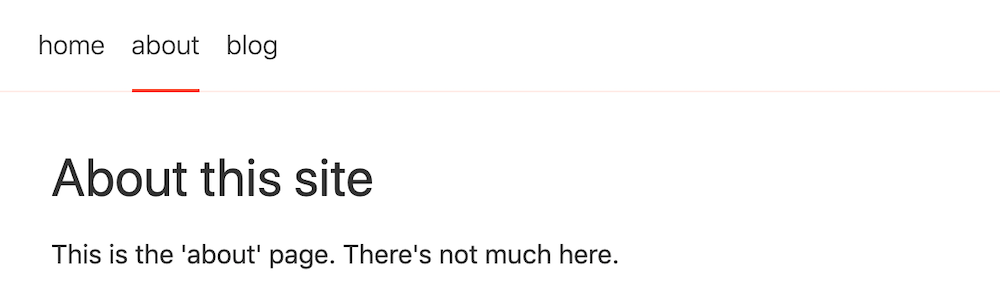
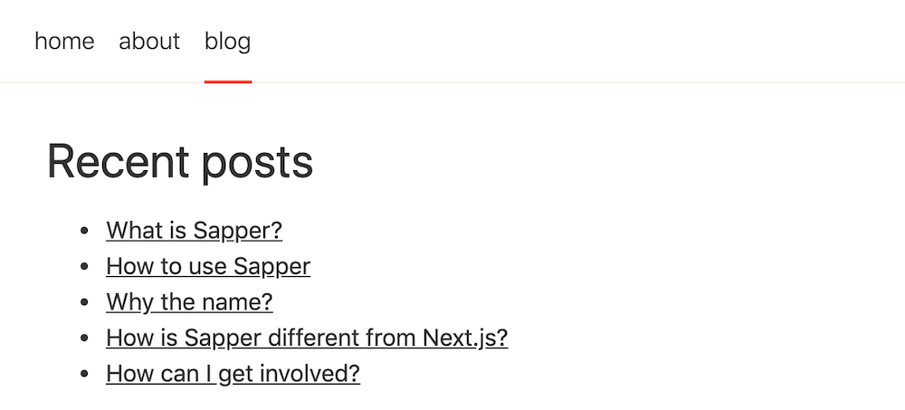
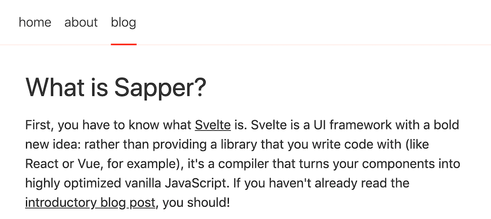
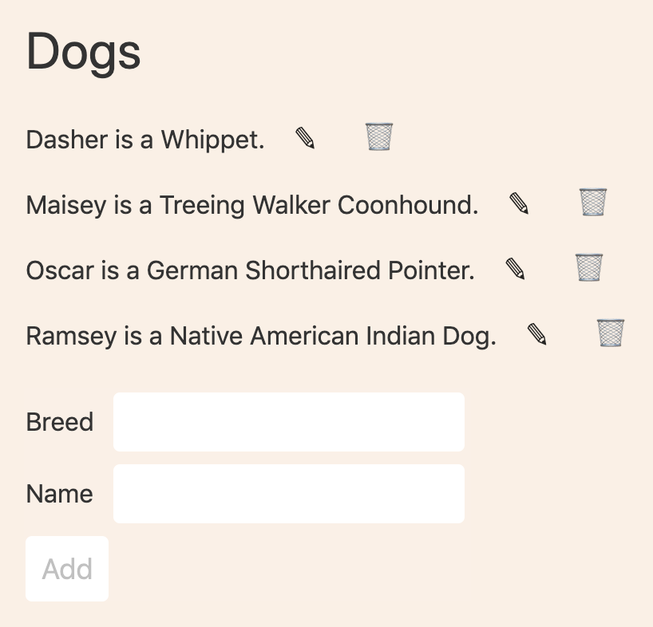
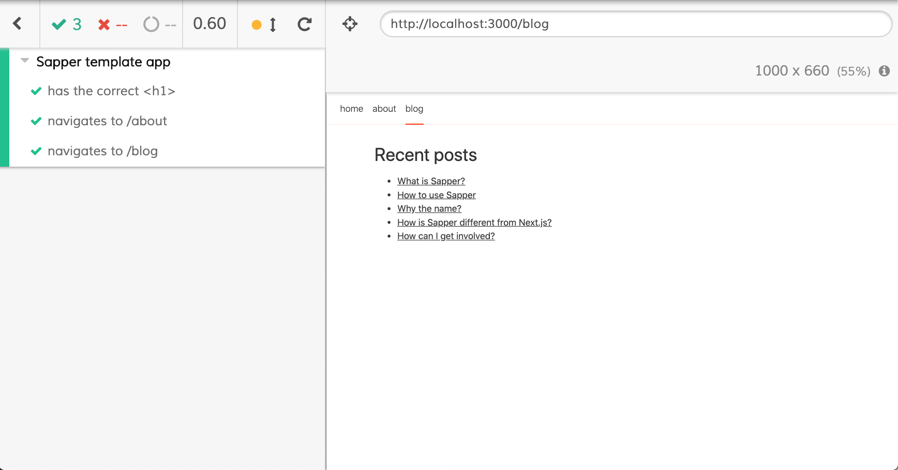

# Sapper - Making Svelte Real

TODO: Sprinkle in building a Sapper app into each of these sections.

This article provides a thorough introduction to Sapper
and walks through the fundamentals necessary
to start building web applications with it.

## What Is Sapper

Sapper (<https://sapper.svelte.dev/>) is a framework built on
Svelte (<https://svelte.dev/>) for creating web applications.

Svelte is an alternative to web frameworks like React, Vue, and Angular.
For more detail on Svelte, see
<https://objectcomputing.com/resources/publications/sett/july-2019-web-dev-simplified-with-svelte>.

Sapper provides many features that are not included by default with Svelte.
These include:

- page routing
- page layouts
- server-side rendering (SSR)
- "server routes" which are Node-based REST services
  defined in the same project as client-side code
- pre-fetching for faster page loads
- code splitting
- static site generation (exporting)
- offline support using ServiceWorker
- end-to-end testing

The name "Sapper" has two meanings.
First, it is a contraction of "Svelte app maker".
Second, the English word "sapper" is defined as
"a soldier responsible for tasks such as building and repairing
roads and bridges, laying and clearing mines, etc."
In a sense, this is what Sapper does for Svelte.

Sapper was created and is maintained by Rich Harris (Rich-Harris on GitHub),
the creator of Svelte, with help from many others including
Alan Faubert (Conduitry on GitHub), Luke Edwards (lukeed on GitHub),
Maurício Kishi (mrkishi on GitHub), and
Nolan Lawson (nolanlawson on GitHub).

## Getting Started

Let's walk through the steps to create and run a Sapper application.

1. Install Node.js from <https://nodejs.org>.

   This installs the `node`, `npm`, and `npx` commands.

2. Create the starting directory structure and files for a new application.  
   Choose between using the Rollup or Webpack module bundler.  
   To use Rollup, enter `npx degit sveltejs/sapper-template#rollup` _`app-name`_.  
   To use Webpack, enter `npx degit sveltejs/sapper-template#webpack` _`app-name`_.

   The `degit` tool is useful for project scaffolding.
   It was created by Rich Harris.
   It downloads a git repo, by default the master branch.
   In this case "sveltejs" is the user name and "sapper-template" is the repository.
   The second argument is the name of the application
   and the name of the sub-directory to create.

3. `cd` _`app-name`_

4. `npm install`

5. `npm run dev`

   This starts a local HTTP server and provides live reload,
   unlike `npm run start` which omits live reload.

6. Browse localhost:3000

   The default Sapper app contains three "pages" or "routes"
   with navigation at the top.
   The routes are "home", "about", and "blog".
   Links on the "blog" page open sub-pages
   that render specific blog content.
   These pages are shown below:

   

   

   

   The following page is rendered when the first link on the previous page is clicked.

   

You are now ready to start modifying the app.

## Sapper File Structure

Sapper apps created from the `sveltejs/sapper-template`
begin with the following directory structure:

- `__sapper__`

  - `build`: destination for build artifacts
  - `dev`: destination for development-mode artifacts
  - `export`: destination for files generated by `npm run export`

- `cypress`: contains directories and files for running end-to-end tests

- `node_modules`: contains files installed from `package.json` dependencies

- `src`: contains application code

  - `components`: contains Svelte components used in pages

    - `Nav.svelte`: defines the nav bar links

      - Modify this to change page navigation.

  - `routes`: contains Svelte components that represent pages

  - `client.js`: starting point of the client-side Sapper app

  - `server.js`: configures the server used for server-side routes (REST services)

    - This uses Polka by default.
    - It can easily be modified to use another library such as Express.

  - `service-worker.js`: defines the ServiceWorker caching strategy

  - `template.html`: HTML template for the Sapper app

    - This defines the `sapper` DOM id targeted by `client.js`.

- `static`: contains static assets such as images and the `global.css` file

- `cypress.json`: contains configuration for Cypress end-to-end tests

- `package.json`: lists dependencies and defines npm scripts

- `README.md`: contains basic documentation on using Sapper

- `rollup.config.js`: contains configuration for the Rollup module bundler

  - Modify this to use preprocessors like Sass and TypeScript.

There is also a directory named `node_modules` under the `src` directory.
Sapper generates this directory and the files inside it.
Placing files here allows them to be imported using Node resolution rules.
Otherwise imports of the these files would have to use relative paths.
This also has the benefit that these files aren't lost
if the top `node_modules` directory is deleted
as part of reinstalling all the dependencies.

Here is the content of the `src/node_modules` directory:

- `@sapper`: contains files provided or generated by Sapper
  that should not be modified

  - `app.mjs`: exports the Sapper API functions including:

    - `goto` for programmatic navigation
    - `start` which is called by `client.js` described earlier

  - `server.mjs`: exports the Sapper `middleware` function
    called by `server.js` described earlier

  - `service-worker.js`: exports constants used by `service-worker.js` described earlier

    - `files` is an array of static files to be cached by the ServiceWorker
    - `shell` is an array of files generated by Sapper to be cached by the ServiceWorker

  - `internal`

    - `App.svelte`: displays the current page, or an error page if there is an error
    - `error.svelte`: default error page component

      - This displays the status, error message,
        and stack trace (if NODE_ENV is "development").

    - `layout.svelte`: basic page layout containing only a `<slot>`
    - `manifest-client.mjs`: provides data about components and routes for `app.mjs` above
    - `manifest-server.mjs`: provides data about server routes and pages for `server.mjs` above
    - `shared.mjs`: seems to provide nothing

For many applications, most of the files described above
do not require modification.
The most common files to modify will be described later.

Add static assets such as images in the `static` directory
and delete the provided images that are not needed.

Modify `static/global.css` to contain CSS that should
be used across all components in the app.

## Dynamic vs. Static Sites

Sapper can be used to build both dynamic and static web applications.

Dynamic Sapper apps are built by running `npm run build`.
This generates files in the `__sapper__/build` directory.
To deploy, copy this directory to server.

To test a dynamic Sapper app locally,
enter `npm run dev` and browse localhost:3000.
This generates files in the `__sapper__/dev` directory.

Static Sapper apps are built by running `npm run export`.
We will learn more about static Sapper apps and their
limitations later in the "Static Site Generation" section.
For now it is enough to understand that HTML for each page
is built by crawling `<a>` tags at build time.

The primary differences between Sapper dynamic and static apps are:

1. Component `preload` functions
   (covered later in the "Pre-fetching" section)
   are called at runtime for dynamic apps as each page is visited
   and at build time for static apps as each page is crawled.

2. Server routes (covered later in the "Server Routes" section)
   are available at runtime for dynamic apps
   and only at build time for static apps.

## Page Routing

Each page in a Sapper app is implemented as a Svelte component
defined in the `src/routes` directory.
Route names are derived from the names of
source files and directories found here.

The default Sapper app includes anchor tags
in the file `src/components/Nav.svelte`.
Modify this file to add or remove page navigation anchor tags.

Consider creating a `NavItem` component in `src/components` to simplify this.
For example:

```html
<script>
  import {createEventDispatcher} from 'svelte';
  const dispatch = createEventDispatcher();

  // "default" would be a better name for this, but that's a keyword.
  export let main = false; // optional

  export let href = undefined; // optional
  export let name; // required
  export let rel = undefined; // optional
  export let segment; // required

  const capitalize = text =>
    text
      .split(' ')
      .map(word => word[0].toUpperCase() + word.substring(1).toLowerCase())
      .join(' ');

  const getClass = segment =>
    main ? (segment ? '' : 'selected') : segment === name ? 'selected' : '';

  const handleClick = () => dispatch('click');
</script>

<style>
  a {
    text-decoration: none;
    padding: 1em 0.5em;
    display: block;
  }

  a:hover {
    color: green;
  }

  li {
    display: block;
    float: left;
  }

  .selected {
    position: relative;
    display: inline-block;
  }

  .selected::after {
    position: absolute;
    content: '';
    width: calc(100% - 1em);
    height: 2px;
    background-color: rgb(255, 62, 0);
    display: block;
    bottom: -1px;
  }
</style>

<li>
  <a
    {rel}
    class="{getClass(segment)}"
    href="{href || name}"
    on:click="{handleClick}"
  >
    {capitalize(name)}
  </a>
</li>
```

To use this `NavItem` component in the `Nav` component,
modify to match the following:

```html
<script>
  import NavItem from './NavItem.svelte';
  export let segment;
</script>

<style>
  nav {
    border-bottom: 1px solid rgba(255, 62, 0, 0.1);
    font-weight: 300;
    height: var(--nav-height);
    padding: 0 1em;
  }

  ul {
    margin: 0;
    padding: 0;
  }
</style>

<nav>
  <ul>
    <NavItem {segment} name="home" />
    <NavItem {segment} name="about" />
    <!-- Use of rel="prefetch" is covered later. -->
    <NavItem {segment} name="blog" rel="prefetch" />
  </ul>
</nav>
```

Define additional pages by creating components in the `src/routes` directory.

Add a `NavItem` instance in `src/components/Nav.svelte` for each new page.

The path to the page component source file for a route named `dogs`
is `src/routes/dogs.svelte` or `src/routes/dogs/index.svelte`.
The latter is preferred when there are
associated server routes (described later).
Creating the `dogs` directory provides a common location
for these related files.

Files in route directories with names that begin with an underscore
are considered helper files and are not interpreted as routes.

A result of these naming conventions is that there will be
many source files within an app that have names that are
not meaningful on their own (such as `index.svelte`).

Some editors support displaying the directory name of files
along with the file name in the tab of each open file.
In VS Code, this is enabled by setting the
`workbench.editor.labelFormat` option to a value like "short".

## Page Layouts

A page layout is a Svelte component that
provides a common layout to a set of pages.
For example, it can be used to add a common
header, footer, and left nav to each rendered page.

Page layouts can be nested.
The main page layout applies to all pages.
Nested page layouts apply to sections of the main page layout.
For example, if the main page layout defines
a header, left nav, main area, and footer
then a nested page layout can define a layout
for what appears in the main area.

The main page layout is defined in `src/routes/_layout.svelte`.

Each route can define its own `_layout.svelte` file that
is used to lay out its content within the main layout.

Layout components can use conditional logic to vary
the layout depending the current app state.

For example, suppose the app has a login page
that requires a different layout than all the other pages.
Typically the login page does not render links or buttons
to navigate to other pages.

Here is how this scenario might be implemented
in `src/routes/_layout.svelte`.
It assumes that we have a store named `authenticated` that
holds a boolean that is set to `true` after a successful login.
If the browser is refreshed, we restore the value
of the `authenticated` store from `sessionStorage`.

```html
<script>
  import {onMount} from 'svelte';
  import {authenticated} from '../stores';
  import Nav from '../components/Nav.svelte';

  // This prop is automatically passed to all layouts.
  // It holds the name of the current route.
  export let segment;

  onMount(() => {
    $authenticated = window.sessionStorage.getItem('authenticated') === 'true';
  });
</script>

<style>
  main {
    display: flex;
    justify-content: center;

    background-color: linen;
    box-sizing: border-box;
    height: calc(100vh - var(--nav-height));
    padding: 2em;
    width: 100vw;
  }
</style>

{#if $authenticated}
<!-- If the user is authenticated, we want to render a nav bar and
     provide a slot where the current page content will be rendered.
     "segment" identifies the current page. -->
<nav {segment} />

<main>
  <section>
    <slot />
  </section>
</main>
{:else}
<!-- If the user is not authenticated, we only want to
     provide a slot where the login page will be rendered. -->
<slot />
{/if}
```

## Server-Side Rendering (SSR)

Sapper provides server-side rendering automatically
with no configuration required.
This is similar to the functionality provided by Next.js for React.

HTML for the first page of an app that is accessed
is generated on the server and downloaded to the browser.
Subsequently visited pages are generated on the client
just like in a normal Svelte app.
This allows for a faster app startup experience.

The client-side app is "hydrated" from server-rendered HTML
rather than recreating the entire DOM for the current page.

There are some restrictions on components
that will be server-side rendered.
Such components cannot:

1. access the `window` object because it is not present
2. rely on lifecycle functions??? TODO: They do seem to run!

There is a way to ensure that a given component will only
be rendered client-side to avoid these restrictions.
It utilizes a dynamic import inside an `onMount` function
of another component.
`onMount` functions are only invoked on the client-side.

For example, the following code loads the component `MyClientOnly`
client-side rather than server-side:

```html
<script>
  import {onMount} from 'svelte';

  let MyClientOnly;

  onMount(async () => {
    const module = await import('MyClientOnly.svelte');
    MyComponent = module.default;
  });
</script>

<!-- This renders a component that is discovered at run-time.
     Note how props can be passed to the component. -->
<svelte:component this={MyClientOnly} someProp="someValue />
```

Note: You tested the code above in your sapper-demo app
inside the file Animations.svelte.

## Server Routes

Server routes are Node-based REST services.
They enables collocating server-side code
with client-side in the same project

Using this feature is optional.
Sapper apps can invoke REST services that
are not implemented in the Sapper app.
And of course the services can be implemented
in any programming language, using any framework.

By default the server routes are managed by Polka (<https://github.com/lukeed/polka>).
Polka is described as "a micro web server so fast, it'll make you dance!"
It was created by Luke Edwards who is also a Sapper contributor.

### Polka

Polka claims to be 33% to 50% faster than Express.
The Polka API is nearly identical to that of Express
and it supports the same middleware.

Sapper applications can easily be modified so that server routes
are managed by another Node.js server library such as Express.

Here are the steps to switch from Polka to Express:

1. `npm uninstall polka`
1. `npm install express`
1. Edit `src/server.js`.
1. Remove `import polka from 'polka';`.
1. Add `import {express} from 'express';`.

By default Sapper uses `sirv` to serve static files.

Assuming the changes described above have been made,
here are the additional steps to
use Express for serving static files:

1. `npm uninstall sirv`
1. Edit `src/server.js`.
1. Remove `import sirv from 'sirv';`.
1. Remove `sirv('static', {dev}),`.
1. Add `express.static('static')),`.
1. Restart the server.

### Server Route Source Files

Sapper has a convention for naming the source files
that define server routes.
Let's assume the route name is "dogs".

Server routes that do not require a path parameter,
such as retrieving all instances of a resource
or creating a new resource,
are typically defined in `src/routes/dogs/index.json.js`.

Server routes that do require a path parameter,
such as updating or deleting an existing resource,
are typically defined in `src/routes/dogs/[id].json.js`.
The syntax `[id]` here represents a path parameter.

Server routes can only have one path parameter per path part.

### Server Route Functions

Server route functions must do only one of these things:

1. Send a response.
2. Call the `next` function, passing it nothing.
   This enables the next "normal" middleware to run.
   One of these can send a response.
3. Call the `next` function, passing it an error description.
   This enables the next error handling middleware to run.
   One of these can log the error and/or
   send a response describing the error.

## Fetch API

There are many JavaScript libraries that support
sending HTTP requests and receiving HTTP responses.
They can be used to invoke REST services.

The Fetch API is one option.
It is popular choice because it is built into modern web browsers.
This allows it to be used without installing another library.

The Fetch API is described at
<https://developer.mozilla.org/en-US/docs/Web/API/Fetch_API>.

We will see examples of sending GET, POST, PUT, and DELETE requests
using the Fetch API later in the "CRUD Example" section.

## Fetch API Wrapper

Module context was described in the Svelte section.
Recall that it is used to define variables and functions
that are associated with the module, not with each instance.

The module context includes everything defined
inside a `<script context="module">` tag.

When using the Fetch API in module context functions,
use `this.fetch` instead of `fetch`.
This is required in order to ensure availability of the Fetch API
when the function is invoked on the server
as happens during server-side rendering.

TODO: Add an example of this.

For functions defined in a normal `<script>` tag,
use the `fetch` function provided by browsers.

## Just Enough MongoDB

In the example code that follows we will be persisting data using MongoDB.
This choice is strictly based on ease of setup and use.
It is not necessarily the best choice for every application.
Also consider using PostgreSQL and other databases.

MongoDB is a NoSQL database implemented in C++.
It stores documents in collections.
Documents are JSON objects.
They are stored in a binary JSON format called BSON.

All documents have an id stored in a property named `_id`.
This is guaranteed to be unique within a collection.

Each collection can have multiple indexes to make queries faster.
Indexes are implemented as B-tree data structures.

There is no need to define a schema that describes
the properties of the document objects.
This speeds up development when the structure changes often
since no schema changes are required.
It also allows properties present in the objects of a collection to vary.
But typically all documents in the same collection have similar properties.

A document property value can be the id of another object,
even in a different collection.
This supports associations between documents.

The free version of MongoDB is called the "Community Edition".

To install the Community Edition, browse
<https://docs.mongodb.com/manual/installation/>.
Click "Install MongoDB Community Edition" in the left nav.
Click the "Install on" link for your platform (Linux, macOS, or Windows),
and follow the instructions.

To start the MongoDB server, TODO:
To stop the MongoDB server, TODO:

MongoDB Shell is a kind of REPL that supports using
JavaScript to interact with a MongoDB database.
To start the shell, enter `mongo`.
Once started, enter `help` to get help on using the shell.
To exit the shell, enter `exit` or press ctrl-d.

To see a list of the current databases, enter `show dbs`.

To use a specific database, enter `use {db-name}`.

New databases are created automatically
when a document is added to a collection.
For example:

```js
use animals
db.dogs.insert({name: 'Dasher', breed: 'Whippet'})
```

## Common MongoDB Shell Operations

To list all the documents in a collection,
enter `db.{coll-name}.find()`.

To delete a collection, enter `db.{coll-name}.drop()`.

To delete the current database, enter `db.dropDatabase()`.

To add a document to a collection, enter `db.{coll}.insert(obj)`.
For example, `db.dogs.insert({breed: 'Whippet', name: 'Dasher'})`.

To get the first 20 documents in a collection,
enter `db.{coll}.find()`.
For example, `db.dogs.find()`.

To get all the documents in a collection that match given criteria,
enter `db.{coll}.find(criteria)`.
For example, `db.dogs.find({breed: 'whippet')`
and `db.tjs.find({lastName: {$gt: 'H'}})`.

To get the number of documents in a collection, enter
`db.{coll}.find().count() or db.{coll}.find().length()`.

To find a specific document in a collection,
enter `db.{coll}.findOne(query)`.
A query is just a JavaScript object where
the keys are document property names and
the values are the desired property values.

To delete a document from a collection,
enter `db.{coll}.deleteOne(query)`.

To delete multiple documents from a collection,
enter `db.{coll}.deleteMany(query)`.

To update a document in a collection, enter
`db.{coll}.updateOne(query, { $set: {key: value, key: value, ...} })`.

To replace a document in a collection, enter
`db.{coll}.replaceOne(query, newDocument)`.

To add an index to a collection for faster queries on a particular property,
enter `db.{coll}.createIndex({ {prop-name}: 1 });`.
Using a value of 1 here indicates ascending order
and using -1 means descending.

## CRUD Example

Let's walk through the steps to implement a page
that supports CRUD operations on dogs.

Here is a screenshot of what we want to create:



With this UI we can:

- See all the dogs that are currently in the database.
- Add a new dog to the database by entering a breed and name,
  and clicking the "Add" button.
- Modify the breed or name of an existing dog in the database
  by clicking the pencil icon next to one,
  modifying the values, and clicking the "Modify" button.
- Delete an existing dog from the database
  by clicking the trash can icon next to one.

Create the directory `src/routes/dogs`.
In this directory, create the following files:

- `index.svelte`  
  This will define the component that renders the UI shown above.

- `index.json.js`  
  This will export middleware functions that get all dogs and create a new dog.
  These are REST services that could be implemented
  with many frameworks using many programming languages,
  but we will see how easy it is to define them using Sapper.

- `[id].json.js`  
  This will export middleware functions that update or delete an existing dog.
  These are more REST services.

- `_helpers.js`  
  This will export a helper function that returns an object
  for operating on the "dogs" MongoDB collection.

Here is the contents of `src/routes/dogs/index.svelte`:

```html
<script context="module">
  // This function is called before each time this
  // component is rendered to get the dogMap data.
  // preload functions are described in more detail later.
  // The parameters of the `preload` function are explained below.
  export async function preload(page, session) {
    try {
      // This invokes the "get" middleware function
      // defined in index.json.js.
      // If the REST service to retrieve all
      // the dogs is hosted outside of Sapper,
      // change the argument to `this.fetch` to be that URL.
      const res = await this.fetch('dogs.json');
      if (res.ok) {
        const dogs = await res.json();
        // Create a map of dog ids to dog objects.
        const dogMap = dogs.reduce((acc, dog) => {
          acc[dog._id] = dog;
          return acc;
        }, {});
        // Properties in the object returned here
        // are passed to this component as props.
        return {dogMap};
      } else {
        // Handle errors.
        const msg = await res.text();
        this.error(res.statusCode, 'Dogs preload: ' + msg);
      }
    } catch (e) {
      this.error(500, 'Dogs preload error: ' + e.message);
    }
  }
</script>

<script>
  // The preload function above passes this prop.
  export let dogMap = {};

  // Parent components can bind to this prop
  // to get an error string set by this component.
  export let error = '';

  let breed = '';
  let breedInput;
  let id = '';
  let name = '';

  $: saveBtnText = id ? 'Modify' : 'Add';

  $: sortedDogs = Object.values(dogMap).sort((dog1, dog2) =>
    dog1.name.localeCompare(dog2.name)
  );

  function clearState() {
    id = breed = name = '';
    breedInput.focus();
  }

  async function deleteDog(id) {
    try {
      const options = {method: 'DELETE'};
      // This invokes the "del" middleware function
      // defined in [id].json.js.
      const res = await fetch(`dogs/${id}.json`, options);
      if (!res.ok) throw new Error('failed to delete dog with id ' + id);
      delete dogMap[id];
      dogMap = dogMap;
      clearState();
    } catch (e) {
      error = e.message;
    }
  }

  function editDog(dog) {
    ({breed, name} = dog);
    id = dog._id;
  }

  // This handles both creating and updating dogs.
  async function saveDog() {
    // If `id` is set, we are updating a dog.
    // Otherwise we are creating a new dog.
    const dog = {breed, name};
    if (id) dog._id = id;

    try {
      const options = {
        method: id ? 'PUT' : 'POST',
        headers: {'Content-Type': 'application/json'},
        body: JSON.stringify(dog)
      };

      const path = id ? `dogs/${id}.json` : 'dogs.json';

      // This invokes either
      // the "post" middleware function defined in index.json.js or
      // the "put" middleware function defined in [id].json.js.
      const res = await fetch(path, options);
      const result = await res.json();

      if (!res.ok) throw new Error(result.error);

      dogMap[result._id] = result;
      dogMap = dogMap; // triggers reactivity

      clearState();
    } catch (e) {
      error = e.message;
    }
  }
</script>

<style lang="scss">
  button {
    border: none;
  }

  .dog-row {
    display: flex;
    align-items: center;
  }

  form {
    margin-top: 1rem;
  }

  form > div {
    margin-bottom: 0.5rem;
  }

  .icon-btn {
    background-color: transparent;
    font-size: 18px;
    margin-left: 0.5rem;
  }

  .icon-btn:hover {
    background-color: lightgreen;
  }

  input {
    width: 200px;
  }

  label {
    margin-right: 0.5rem;
  }
</style>

<svelte:head>
  <title>About</title>
</svelte:head>

<h1>Dogs</h1>

{#if error}
  <div class="error">Error: {error}</div>
{:else}
  {#each sortedDogs as dog}
    <div class="dog-row">
      {dog.name} is a {dog.breed}.
      <button class="icon-btn" on:click={() => editDog(dog)}>
        <!-- pencil icon -->
        &#x270E;
      </button>
      <button class="icon-btn" on:click={() => deleteDog(dog._id)}>
        <!-- trash can icon -->
        &#x1F5D1;
      </button>
    </div>
  {/each}
{/if}

<form>
  <div>
    <label>Breed</label>
    <input bind:this={breedInput} bind:value={breed} />
  </div>
  <div>
    <label>Name</label>
    <input bind:value={name} />
  </div>

  <button disabled={!breed || !name} on:click|preventDefault={saveDog}>
    {saveBtnText}
  </button>

  {#if id}
    <button on:click|preventDefault={clearState}>Cancel</button>
  {/if}
</form>
```

The `page` parameter of the `preload` function
is not used here. It is an object
with `host`, `path`, `query`, and `params` properties.
An example `host` value is "localhost:3000".
An example `path` value is "dogs".

The `session` parameter of the `preload` function
is also not used here. It is an object
containing session data, but is undefined when not using sessions.

Here is the contents of `src/routes/dogs/_helper.js`.
It provides a helper function used by functions in other source files
to obtain the MongoDB "animals" collection.

```js
const {MongoClient} = require('mongodb');

// MongoDB thinks localhost is a different database instance than 127.0.0.1.
// "mongo" shell uses 127.0.0.1, so use that to hit the same instance.
const url = 'mongodb://127.0.0.1:27017';
const options = {useNewUrlParser: true, useUnifiedTopology: true};
let collection;

export async function getCollection() {
  if (!collection) {
    // Only connect once.
    const client = await MongoClient.connect(url, options);

    //TODO: Is it okay that you never call client.close()?
    const db = client.db('animals');

    //TODO: Why is this disable needed?
    //eslint-disable-next-line require-atomic-updates
    collection = await db.collection('dogs');
  }

  return collection;
}
```

Here is the contents of `src/routes/dogs/index.json.js`.
It is for server routes that do not require any path parameters.

```js
import {getCollection} from './_helpers';

// This handles GET requests.
export async function get(req, res) {
  try {
    const collection = await getCollection();
    const result = await collection.find().toArray();
    res.end(JSON.stringify(result));
  } catch (e) {
    res.status(500).json({error: e.message});
  }
}

// This handles POST requests.
export async function post(req, res) {
  const dog = req.body;
  try {
    const collection = await getCollection();
    const result = await collection.insertOne(dog);
    const [obj] = result.ops;
    res.end(JSON.stringify(obj));
  } catch (e) {
    res.status(500).json({error: e.message});
  }
}
```

Here is the contents of `src/routes/dogs/[id].json.js`.
It is for server routes that require one path parameter.

```js
const {ObjectId} = require('mongodb');
import {getCollection} from './_helpers';

// This handles DELETE requests.
export async function del(req, res) {
  const {id} = req.params;
  try {
    const collection = await getCollection();
    const result = await collection.deleteOne({_id: ObjectId(id)});
    if (result.deletedCount === 0) {
      res.status(404).send(`no dog with id ${id} found`);
    } else {
      res.end();
    }
  } catch (e) {
    res.status(500).json({error: e.message});
  }
}

// This handles PUT requests.
export async function put(req, res) {
  const {id} = req.params;
  const replacement = req.body;

  // The object passed to the MongoDB replaceOne method
  // cannot have an _id property.
  delete replacement._id;

  try {
    const collection = await getCollection();
    const result = await collection.replaceOne(
      {_id: ObjectId(id)},
      replacement
    );
    const [obj] = result.ops;
    obj._id = id; // restore the _id property
    res.end(JSON.stringify(obj));
  } catch (e) {
    res.status(500).json({error: e.message});
  }
}
```

Add a navigation link for the `Dogs` component
by adding the following in `src/components/Nav.svelte`:

```html
<NavItem {segment} name="dogs" rel="prefetch" />
```

The impact of `rel="prefetch"` is described in the next section.

That's it! We have implement a new route
that supports all the CRUD operations on dogs.

## Pre-fetching

Routes can be configured so the data they require
is downloaded when the user simply hovers over
their anchor tag. This anticipates that the user will
click the anchor tag and results in faster page loads.

Pre-fetching is configured by adding
the `rel="prefetch"` attribute
to the anchor tag for a component.

Pre-fetching works in conjunction with code splitting.
The first time a user hovers over
an anchor tag that uses prefetch
(or taps on it when using a mobile device),
the JavaScript required by the page is downloaded
and its `preload` function, if any, is called.
This occurs before the component is rendered.

Recall that `preload` functions must be defined
in module scope (`<script context="module">`).
A `preload` function can invoke REST services
to gather data needed by the component and
cause it to be passed to the component as props.

Defining a `preload` function in a component
that is not a route has no purpose
because it will never be invoked.

It is not possible to register the same component
for multiple route paths because the route path
also specifies the path to the component `.svelte` file.

Note how the `onMount` lifecycle function
differs from the `preload` function.

The `onMount` function is invoked once for
each instance of a component that is created.
It can directly set top-level component variables
that represent the state of the component.

Understanding when the `preload` function
is called is a bit more complicated.

When pre-fetching is not configured,
the `preload` function is called
each time the anchor for the route is clicked
and it is not the current route.

When pre-fetching is configured,
the `preload` function is called
when the user hovers over the anchor for the route.
It will not be called again due to a hover
unless the user first navigates to another route or
hovers over another route that has a `preload` function.

The `rel="prefetch"` attribute cannot
be applied to `<button>` elements,
but anchor tags can be styled to look like buttons.

For example:

```html
<style>
  a {
    border: solid gray 1px;
    border-radius: 4px;
    padding: 4px;
    text-decoration: none;
  }
</style>

<a href="/dogs" rel="prefetch">
  Go To Dogs
</a>
```

## Code Splitting

Code splitting removes the need to download all the JavaScript
for the app when the first page is rendered.

When a browser first loads a Sapper app,
only the JavaScript code necessary to
render the first page/route is downloaded.
The JavaScript for each remaining route
is not downloaded until it rendered,
typically in response to a user clicking on an anchor tag
that triggers a route change.

Svelte produces bundles that are much smaller
than those produced by other frameworks.
But the initial download size can be decreased
even further by code splitting.
This is automatically provided by Sapper.
It provides a significant improvement for apps
that are run with slow internet connections
or on mobile devices.

For routes whose anchor tag includes `rel="prefetch"`,
download of their JavaScript code begins
when the user hovers over their anchor tag.

In the starter app, this is specified on
anchor tags in `src/components/Nav.svelte`.˜
The "blog" route uses pre-fetching.

## Static Site Generation

Sapper can crawl the anchor tags in an app
in order to generate HTML for an entire site.
This includes running `preload` functions
that often make REST calls to gather data
needed to render pages.

This is similar to the functionality provided by Gatsby for React.

To build a static site, enter `npm run build`,
just like for a dynamic site.
Then enter `npm run export` which generates
files in the `__sapper__/export` directory.

The `export` script recursively crawls every `<a>` tag reachable from
`src/routes/_layout.svelte` to find all the pages of the app.

If any reachable pages contain a
`preload` function that make REST calls,
the servers for those must be running
when the `export` script is run.
Each of these REST calls is invoked and
their responses are written to `.json` files.
When the static site is browsed, these `.json` files
are used in place of the REST calls.

REST calls made from other JavaScript functions
not in the module context can still be made at runtime.
However, server routes are not available at runtime
so these must be calls to REST services that are
not implemented as server routes in the Sapper app.

To test the site locally, enter `npx serve __sapper__/export`
and browse <http://localhost:5000>.

During development of a static site it will be
necessary to run these commands many times.
To simplify this:

1. `npm install -D npm-run-all serve`
2. Add this npm script:

   ```json
   "serve": "serve __sapper__/export",
   ```

3. Add this npm script:

```json
"static": "npm-run-all build export serve",
```

Now `npm run static` can be used to run
both the `export` and `serve` scripts.

Let's walk through an example of building a static site
starting with the Sapper app template.
We will modify it so the "About" page is replaced
by a "Dogs" page that displays a list of dogs.

First we will build the app and test it as a dynamic site.

- Enter `npx degit "sveltejs/sapper-template#rollup" my-static-site`.

- Enter `cd my-static-site`.

- Enter `npm install`.

- Enter `npm run dev`.

- Browse <http://localhost:5000>.

- Verify that the app works, including clicking the "about" tab.

- Edit `src/components/Nav.svelte` and change all occurrences of "about" to "dogs".

- Create a "dogs" directory under `src/routes`.

- Create `src/routes/dogs/index.svelte` containing the following:

  ```html
  <script context="module">
    // This is the same preload function we saw
    // in the CRUD example section earlier.
    export async function preload() {
      try {
        const res = await this.fetch('dogs.json');
        // This invokes the "get" middleware function
        // defined in index.json.js.
        // If the REST service to retrieve all
        // the dogs is hosted outside of Sapper,
        // change the argument to `this.fetch` to be that URL.
        if (res.ok) {
          const dogs = await res.json();
          const dogMap = dogs.reduce((acc, dog) => {
            acc[dog._id] = dog;
            return acc;
          }, {});
          // Properties in the object returned
          // are passed to this component as props.
          return {dogs: dogMap};
        } else {
          // Handle errors.
          const msg = await res.text();
          this.error(res.statusCode, 'Dogs preload: ' + msg);
        }
      } catch (e) {
        this.error(500, 'Dogs preload error: ' + e.message);
      }
    }
  </script>

  <script>
    // The preload function above makes this available as a prop.
    export let dogs;
  </script>

  <svelte:head>
    <title>Dogs</title>
  </svelte:head>

  <h2>Dogs</h2>
  {#each Object.values(dogs) as dog}
  <div>{dog.name} is a {dog.breed}</div>
  {/each}
  ```

- Create `src/routes/dogs/index.json.js`.

  This implements a REST service that is invoked
  by sending a GET request to <http://localhost:3000/dogs>.
  It doesn't get the dogs from a database
  as was done in the "CRUD Example" section earlier..
  It just returns a hard-coded collection of dogs.
  But it does demonstrate the concept
  of using a REST service to get them.

  If the REST service to retrieve dogs
  is implemented outside of Sapper,
  this file is not needed.

  ```js
  let lastId = 0;
  const dogs = {};

  function addDog(breed, name) {
    const dog = {id: ++lastId, breed, name};
    dogs[dog.id] = dog;
  }

  addDog('Whippet', 'Dasher');
  addDog('Treeing Walker Coonhound', 'Maisey');
  addDog('Native American Indian Dog', 'Ramsey');
  addDog('German Shorthaired Pointer', 'Oscar Wilde');

  export function get(req, res) {
    res.end(JSON.stringify(dogs));
  }
  ```

- Start the app as a dynamic app by entering `npm run dev`.

- Browse <http://localhost:3000>.

- Click the "dogs" tab and verify that a list of dogs is rendered.

Here are the steps to build a static version of this app.

- Enter `npm run build`.

- If the REST service to retrieve all the dogs
  is implemented outside of Sapper,
  start that server.

- Enter `npm run export`.
  Among other files, this creates `__sapper__/export/dogs.json`
  containing the JSON returned by `get` function above.

- Enter `npx serve __sapper__/export`.

- Browse <http://localhost:5000>.

- Click the "dogs" tab and verify that
  the same list of dogs is rendered,
  this time using the generated `dogs.json` file
  instead of calling a REST service.

## Image Optimization

Sapper needs a way to automate image optimization.
TODO: Looks like it is coming soon. See <https://github.com/sveltejs/sapper/issues/172>

## Hot Reloading

Live reloading reloads the entire app when a file it uses is modified.
The current state of the app is lost
and all state reverts to its initial values.

Hot reloading updates the DOM based changes to source files
without losing application state.

Sapper supports live reloading, but does not currently hot reloading.
See issue #2377 at <https://github.com/sveltejs/svelte/issues/2377>.

Recall that in the Svelte section "Persisting Stores"
we saw a way to create a custom store that persists its value
in `sessionStorage` and restores it from there on browser refresh.

## Offline Support Using ServiceWorker

Using a ServiceWorker allows parts of a web application
to continue being usable after network connectivity is lost.

TODO: Is the ServiceWorker enabled by default? I think it is.

TODO: Describe the caching policies it uses by default.

The default ServiceWorker used by Sapper will use
cached REST service data when the data source is unavailable,
such as when a MongoDB server is stopped.
TODO: Verify this. It seems wrong.
TODO: If the REST service is up, but the database server it uses is down, that probably results in an error.

The ServiceWorker can be stopped in the Chrome devtools.
Select the "Application" tab and "Service Workers" in left nav.
TODO: Then do what to stop it?

## End-to-End Testing

The default Sapper app template includes
an npm scripts to run Cypress tests
and view the results.

However, Cypress is not installed by default.
To install it, enter `npm install -D cypress`.

To run the tests in batch mode so all the results are displayed
in a terminal window, enter `npm run test`.
When running the tests this way,
it is not required to start a local server
before running the tests.
TODO: Is this because it does it for you?

To run the test in the default browser,
first start the server by entering `npm run dev`
and then enter `npm run cy:open`.



A sample test is provided in `cypress/integration/spec.js`.

To implement a Cypress test TODO: finish this

## page and session

TODO: Where does this content belong?

`page` and `session` are available as stores in all components.
TODO: What data do they hold? Try the following:

```html
<script>
  import {stores} from '@sapper/app';
  const {preloading, page, session} = stores();
</script>

{$page} {$session}
```

## Authentication

TODO: Consider describing at least one option for implementing authentication,
TODO: and perhaps authorization, in a Sapper app.
TODO: Perhaps use express-session like in this article:
TODO: <https://www.nielsvandermolen.com/authentication-example-svelte-sapper/>

## Deployment Options

There are many options for deploying web applications.
We will focus on two of them, Netlify and ZEIT Now.
Both provided continuous deployment with zero configuration.
Pushes to the the repository of an application trigger this.

### Deploying With Netlify

Netlify bills itself as "All-in-one platform for automating modern web projects."

TODO: Add screenshots for each of these steps.

To get started using Netlify, browse <https://www.netlify.com/>,
press the "Get started for free" button, and sign up.
If you already have an account, click "Log in" in the upper-right.

Code for the application must be in GitHub, GitLab, or Bitbucket.

To add an application, build, and deploy it:

1. Press the "New site from Git" button.

2. Click the button for one of the supported repository services.
   A dialog will open.

3. Press the "Authorize ..." button to
   grant Netlify access to repositories.

4. Select the account where Netlify should be installed
   to allow it to host applications in repositories there.

5. Choose between allowing Netlify to access all repositories
   or only selected repositories (preferred).
   If the latter is selected, choose a specific repository.

6. Press the "Install" button.

7. Enter your password for the version control service.

8. Click a repository name to configure its Netlify options.
   These include the branch to deploy,
   the build command to run, and
   the directory to publish that contains build artifacts.
   In the case of Svelte and Sapper,
   the build command should be `npm run build`.
   The directory to publish for should be "public" for Svelte
   and "**sapper**/build" for Sapper.

9. To set environment variables required by the build process,
   press the "Show advanced" button.
   For each variable, press the "New variable" button
   and enter a name and value.

10. Press the "Deploy site" button.
    The message "Deployment in progress" will appear for a few seconds
    and then the URL of the newly deployed application is displayed.

11. This URL is fine for testing, but you will want a better URL for users.
    To change the URL, press the "Site settings" button
    and the "Change site name" button.
    Enter a new site name. It must be unique among
    all domains that end in ".netlify.com".

12. To add a custom domain, press the "Domain settings"
    and "Add custom domain" buttons.

13. To run the app, click its URL link
    or enter the URL in a browser.

To trigger a new deploy, click "Deploys" near the top of the page,
click the "Trigger deploy" drop-down,
and select "Deploy site".

Netlify sites are automatically secured with HTTPS
using a "Let's Encrypt" certificate.

When changes are pushed to the repository,
Netlify will automatically build and deploy it.

At the time of this writing, Netlify has three tiers:
Starter, Pro, and Business.

The Starter tier is free and only supports a single user.

The Pro tier is \$45/month and adds support for 3+ team members
and password-protected sites.

The Business tier is \$500+/month and adds
single sign-on (SSO), role-based access control (RBAC),
full audit logs, 24/7/365 support options, a CDN,
and a 99.99% uptime SLA.
Pricing is also based on bandwidth usage
and amount of monthly build times.

TODO: Summarize pricing for advanced features.

TODO: How does this handle apps that require a database such as MongoDB?

TODO: Consider describing the steps to deploy a Sapper app on Netlify.

TODO: What are Netlify Immutable Deploys? See <https://www.swyx.io/writing/svelte-static/>.

### Deploying With ZEIT Now

ZEIT Now bills itself as "The easiest way to deploy websites."

TODO: Add screenshots for each of these steps.

To get started using ZEIT Now, browse <https://zeit.co/>
and press the "Deploy Free" button.
Click the "Continue with GitHub" button,
"Continue with GitLab" button, or "continue with email" link.
Follow the instructions to finish creating an account.

If you already have an account, click "Login" in the upper-right.

Code for the application must be in a GitHub repository,
a GitLab repository, or be created from a predefined template.
Note that Bitbucket is not currently supported.

There are templates for many kinds of projects including
"Create-React-App", "Next.js", "Gatsby",
"Vue.js", "Nuxt.js", "Svelte", and "Sapper".

To add a project, build, and deploy it:

1. Click "Create New Project".

2. The first time a given repository service is used,
   Now integration must be installed.
   For example, for GitHub click the "Install Now For GitHub" button.

3. Select an account, and enable it for
   "All repositories" or "Only select repositories" (preferred).

4. Press the "Install" button.

5. Enter the password for the repository service.

6. To use an existing repository,
   select it and press the "IMPORT" button.

7. Wait for the initial project build to complete.

8. To run the app, browse the provided URL
   which will have the format {project-name}.{username}.now.sh".
   Alternatively, just press the "VISIT" button.

When changes are pushed to the repository,
ZEIT Now will automatically build and deploy it.

TODO: Can you specify the branch to watch or is it only "master"?

At the time of this writing, ZEIT Now has four tiers:
Free, Pro, Business, and Enterprise.

The Free tier only supports a single user.

The Pro tier is \$20/month and adds support for 3+ team members.

The Business tier is \$200/month and adds
"email domain single sign-on", an SLA for 100% uptime,
and custom SSL certificates.

The Enterprise tier has custom pricing and adds
24/7/365 chat support, role-based access control, and full audit logs.
Pricing is also based on bandwidth usage
and amount of monthly build times.

TODO: Does your code have to be public in order to use the free tier?
TODO: Summarize pricing for advanced features.

## Conclusion

There you have it! Sapper is a great addition to Svelte.
Opinions vary, but I believe most Svelte applications
should be built with Sapper.

Thanks so much to ? for reviewing this article!

Please send corrections and feedback to <mark@objectcomputing.com>.
